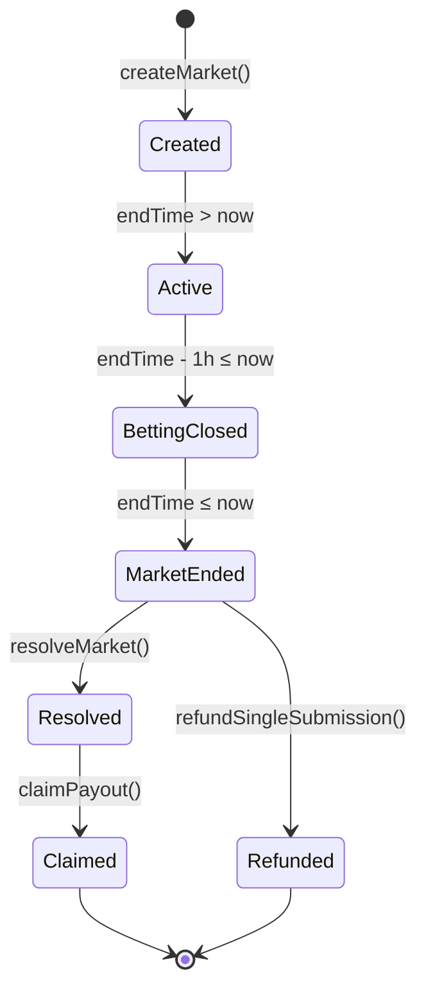
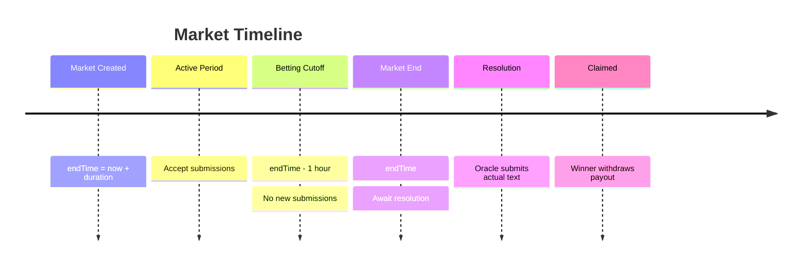

Every Proteus market follows a deterministic lifecycle with clearly defined states and transitions. Understanding this flow is essential for participants and developers.

## Lifecycle Overview



## State Definitions

### 1. Created

<Card title="Market Created" icon="plus-circle">
  **Trigger**: `createMarket(actorHandle, duration)`
  
  **State**: Market exists but may have no submissions yet
  
  **Constraints**:
  - Duration must be between 1 hour and 30 days
  - Actor handle specified
  - Pool starts at 0 ETH
</Card>

```solidity PredictionMarketV2.sol:139-159
function createMarket(
    string calldata _actorHandle,
    uint256 _duration
) external whenNotPaused returns (uint256) {
    if (_duration < 1 hours || _duration > 30 days) revert InvalidDuration();
    
    uint256 marketId = marketCount++;
    
    markets[marketId] = Market({
        actorHandle: _actorHandle,
        endTime: block.timestamp + _duration,
        totalPool: 0,
        resolved: false,
        winningSubmissionId: 0,
        creator: msg.sender
    });
    
    emit MarketCreated(marketId, _actorHandle, block.timestamp + _duration, msg.sender);
    
    return marketId;
}
```

<Accordion title="Contract Constants">
  ```solidity
  uint256 public constant MIN_BET = 0.001 ether;
  uint256 public constant BETTING_CUTOFF = 1 hours;
  uint256 public constant MIN_SUBMISSIONS = 2;
  uint256 public constant MAX_TEXT_LENGTH = 280;
  ```
</Accordion>

### 2. Active (Accepting Submissions)

<Card title="Active Market" icon="clock">
  **Condition**: `block.timestamp < endTime - BETTING_CUTOFF`
  
  **Actions Allowed**:
  - Submit predictions with ETH stake
  - View current submissions and pool size
  
  **Actions Prohibited**:
  - Cannot resolve market
  - Cannot claim payouts
</Card>

```solidity PredictionMarketV2.sol:167-198
function createSubmission(
    uint256 _marketId,
    string calldata _predictedText
) external payable whenNotPaused nonReentrant returns (uint256) {
    Market storage market = markets[_marketId];
    
    if (market.endTime == 0) revert MarketNotFound();
    if (market.resolved) revert MarketAlreadyResolved();
    if (block.timestamp >= market.endTime) revert MarketEnded();
    if (block.timestamp >= market.endTime - BETTING_CUTOFF) revert BettingCutoffPassed();
    if (msg.value < MIN_BET) revert InsufficientBet();
    if (bytes(_predictedText).length == 0) revert EmptyPrediction();
    if (bytes(_predictedText).length > MAX_TEXT_LENGTH) revert PredictionTooLong();
    
    uint256 submissionId = submissionCount++;
    
    submissions[submissionId] = Submission({
        marketId: _marketId,
        submitter: msg.sender,
        predictedText: _predictedText,
        amount: msg.value,
        claimed: false
    });
    
    marketSubmissions[_marketId].push(submissionId);
    userSubmissions[msg.sender].push(submissionId);
    market.totalPool += msg.value;
    
    emit SubmissionCreated(submissionId, _marketId, msg.sender, _predictedText, msg.value);
    
    return submissionId;
}
```

#### Submission Validation

<Steps>
  <Step title="Market Exists">
    `endTime != 0` (market was created)
  </Step>
  
  <Step title="Not Yet Resolved">
    `resolved == false`
  </Step>
  
  <Step title="Before Market End">
    `block.timestamp < endTime`
  </Step>
  
  <Step title="Before Betting Cutoff">
    `block.timestamp < endTime - 1 hour`
  </Step>
  
  <Step title="Minimum Stake">
    `msg.value >= 0.001 ETH`
  </Step>
  
  <Step title="Valid Text">
    Not empty, ≤ 280 characters
  </Step>
</Steps>

<Warning>
**Betting Cutoff**: The 1-hour cutoff before market end prevents last-second front-running when the resolution text may already be known.
</Warning>

### 3. Betting Closed

<Card title="Betting Closed" icon="ban">
  **Condition**: `endTime - BETTING_CUTOFF ≤ block.timestamp < endTime`
  
  **Duration**: Final 1 hour before market end
  
  **State**: No new submissions accepted, waiting for market to end
</Card>

This is a "cooling off" period. The actual post may already be published, but oracles need time to verify and submit the resolution.

### 4. Market Ended (Awaiting Resolution)

<Card title="Market Ended" icon="hourglass-end">
  **Condition**: `block.timestamp >= endTime && !resolved`
  
  **Next Steps**:
  - Oracle fetches actual text from X API
  - Owner calls `resolveMarket()` with actual text
  - **OR** if only 1 submission exists: anyone can call `refundSingleSubmission()`
</Card>

<Tabs>
  <Tab title="Normal Resolution (≥2 submissions)">
    ```solidity PredictionMarketV2.sol:207-244
    function resolveMarket(
        uint256 _marketId,
        string calldata _actualText
    ) external onlyOwner {
        Market storage market = markets[_marketId];
        
        if (market.endTime == 0) revert MarketNotFound();
        if (market.resolved) revert MarketAlreadyResolved();
        if (block.timestamp < market.endTime) revert MarketNotEnded();
        
        uint256[] storage subIds = marketSubmissions[_marketId];
        if (subIds.length < MIN_SUBMISSIONS) revert MinimumSubmissionsNotMet();
        
        // Find submission with minimum Levenshtein distance
        uint256 winningId = subIds[0];
        uint256 minDistance = levenshteinDistance(
            submissions[subIds[0]].predictedText,
            _actualText
        );
        
        for (uint256 i = 1; i < subIds.length; i++) {
            uint256 distance = levenshteinDistance(
                submissions[subIds[i]].predictedText,
                _actualText
            );
            // Strict less-than: first submitter wins ties
            if (distance < minDistance) {
                minDistance = distance;
                winningId = subIds[i];
            }
        }
        
        market.resolved = true;
        market.winningSubmissionId = winningId;
        
        emit MarketResolved(_marketId, winningId, _actualText, minDistance);
    }
    ```
  </Tab>
  
  <Tab title="Single Submission Refund">
    ```solidity PredictionMarketV2.sol:280-301
    function refundSingleSubmission(uint256 _marketId) external nonReentrant {
        Market storage market = markets[_marketId];
        
        if (market.endTime == 0) revert MarketNotFound();
        if (market.resolved) revert MarketAlreadyResolved();
        if (block.timestamp < market.endTime) revert MarketNotEndedForRefund();
        
        uint256[] storage subIds = marketSubmissions[_marketId];
        if (subIds.length != 1) revert NotSingleSubmission();
        
        Submission storage submission = submissions[subIds[0]];
        if (submission.claimed) revert AlreadyClaimed();
        
        submission.claimed = true;
        market.resolved = true;  // Mark as resolved
        
        // Full refund - no fee taken
        (bool success, ) = submission.submitter.call{value: submission.amount}("");
        if (!success) revert TransferFailed();
        
        emit SingleSubmissionRefunded(_marketId, subIds[0], submission.submitter, submission.amount);
    }
    ```
    
    <Info>
    **No competition = full refund**: If a market ends with only one submission, that participant receives a full refund (no 7% fee). This prevents penalizing someone when there was no actual competition.
    </Info>
  </Tab>
</Tabs>

### 5. Resolved

<Card title="Market Resolved" icon="check-circle">
  **Condition**: `resolved == true && winningSubmissionId != 0`
  
  **State**:
  - Winner determined by minimum Levenshtein distance
  - First submitter wins ties (deterministic)
  - Pool ready for winner to claim
</Card>

#### Winner Determination Logic

<Steps>
  <Step title="Calculate All Distances">
    For each submission, compute `d_L(predictedText, actualText)` on-chain
  </Step>
  
  <Step title="Find Minimum">
    `winningId = argmin_{submissions} d_L`
  </Step>
  
  <Step title="Break Ties">
    Use strict less-than (`distance < minDistance`), so first submitter wins ties
  </Step>
  
  <Step title="Store Result">
    Set `market.winningSubmissionId`
  </Step>
</Steps>

<Accordion title="Why First Submitter Wins Ties?">
  This creates an incentive to submit early and confidently. Waiting to see others' submissions provides no advantage because:
  
  1. All submissions are committed on-chain (can't change after submitting)
  2. Comparison is against actual text, not other submissions
  3. Early submission shows conviction
  
  The tie-breaking rule is deterministic and documented, ensuring fairness.
</Accordion>

### 6. Claimed

<Card title="Payout Claimed" icon="hand-holding-dollar">
  **Trigger**: Winner calls `claimPayout(submissionId)`
  
  **Final State**: ETH transferred to winner, fees accumulated for withdrawal
</Card>

```solidity PredictionMarketV2.sol:250-273
function claimPayout(uint256 _submissionId) external nonReentrant {
    Submission storage submission = submissions[_submissionId];
    Market storage market = markets[submission.marketId];
    
    if (submission.submitter == address(0)) revert SubmissionNotFound();
    if (!market.resolved) revert MarketNotEnded();
    if (market.winningSubmissionId != _submissionId) revert NotWinningSubmission();
    if (submission.claimed) revert AlreadyClaimed();
    
    submission.claimed = true;
    
    uint256 totalPool = market.totalPool;
    uint256 fee = (totalPool * PLATFORM_FEE_BPS) / 10000;  // 7%
    uint256 payout = totalPool - fee;
    
    // Accumulate fees for pull-based withdrawal
    pendingFees[feeRecipient] += fee;
    
    // Transfer payout to winner
    (bool success, ) = submission.submitter.call{value: payout}("");
    if (!success) revert TransferFailed();
    
    emit PayoutClaimed(_submissionId, submission.submitter, payout);
}
```

#### Payout Calculation

<CodeGroup>
```solidity Fee Calculation
fee = floor(totalPool × 700 / 10000)  // 7% = 700 basis points
payout = totalPool - fee               // 93% to winner
```

```solidity Example
Total Pool: 1.0 ETH
Fee: 0.07 ETH (7%)
Winner Payout: 0.93 ETH (93%)
```
</CodeGroup>

<Info>
**Pull-based fees**: Fees accumulate in `pendingFees[feeRecipient]` and are withdrawn separately. This prevents griefing attacks where a malicious fee recipient reverts transfers.
</Info>

## Special Cases

### The NULL Sentinel

<Card title="Predicting Silence" icon="ban">
  Markets can resolve with `__NULL__` if the target doesn't post.
  
  **Use Case**: Betting that a public figure will *not* post during the market window
</Card>

```text
Prediction: __NULL__
Actual: __NULL__ (no post)

Levenshtein distance: 0 (exact match)
Result: Perfect prediction, winner takes entire pool
```

<Accordion title="Example: Jensen Huang Stays Silent">
  From Example 4 in the whitepaper:
  
  | Submitter | Prediction | Distance |
  |-----------|-----------|----------|
  | **Null trader** | `__NULL__` | **0** |
  | Human (guessing) | "Jensen will flex about Blackwell..." | 46 |
  | AI Roleplay | "NVIDIA Blackwell Ultra is sampling..." | 90 |
  
  **Winner**: Null trader at distance 0 (exact match)
  
  <Info>
  AI roleplay agents **always generate text** - they cannot predict silence. The `__NULL__` sentinel enables a market primitive that binary contracts cannot express.
  </Info>
</Accordion>

### Emergency Withdrawal

<Card title="Admin Safety Valve" icon="triangle-exclamation">
  **Trigger**: Owner only, 7+ days after market end, market not resolved
  
  **Action**: Refund all participants, mark market as resolved
  
  **Purpose**: Recover funds if oracle fails or resolution becomes impossible
</Card>

```solidity PredictionMarketV2.sol:425-447
function emergencyWithdraw(uint256 _marketId) external onlyOwner nonReentrant {
    Market storage market = markets[_marketId];
    
    if (market.endTime == 0) revert MarketNotFound();
    if (market.resolved) revert MarketAlreadyResolved();
    // Only allow 7 days after market end
    if (block.timestamp < market.endTime + 7 days) revert MarketNotEnded();
    
    market.resolved = true;
    
    uint256[] storage subIds = marketSubmissions[_marketId];
    for (uint256 i = 0; i < subIds.length; i++) {
        Submission storage sub = submissions[subIds[i]];
        if (!sub.claimed && sub.amount > 0) {
            sub.claimed = true;
            (bool success, ) = sub.submitter.call{value: sub.amount}("");
            // Continue even if transfer fails
            if (success) {
                emit SingleSubmissionRefunded(_marketId, subIds[i], sub.submitter, sub.amount);
            }
        }
    }
}
```

## State Diagram Details

### Time-Based Transitions



### Guard Conditions

Each state transition has strict guard conditions:

<Tabs>
  <Tab title="Create Market">
    ```solidity
    require(_duration >= 1 hours && _duration <= 30 days);
    require(!paused);
    ```
  </Tab>
  
  <Tab title="Submit Prediction">
    ```solidity
    require(market.endTime > 0);  // Market exists
    require(!market.resolved);     // Not resolved yet
    require(block.timestamp < market.endTime);  // Not ended
    require(block.timestamp < market.endTime - BETTING_CUTOFF);  // Not in cutoff
    require(msg.value >= MIN_BET);  // 0.001 ETH minimum
    require(bytes(_predictedText).length > 0 && <= MAX_TEXT_LENGTH);
    ```
  </Tab>
  
  <Tab title="Resolve Market">
    ```solidity
    require(msg.sender == owner);  // Only owner
    require(market.endTime > 0);   // Market exists
    require(!market.resolved);     // Not already resolved
    require(block.timestamp >= market.endTime);  // Market ended
    require(submissions.length >= MIN_SUBMISSIONS);  // At least 2 submissions
    ```
  </Tab>
  
  <Tab title="Claim Payout">
    ```solidity
    require(submission.submitter != address(0));  // Submission exists
    require(market.resolved);  // Market resolved
    require(market.winningSubmissionId == _submissionId);  // This is winner
    require(!submission.claimed);  // Not already claimed
    ```
  </Tab>
</Tabs>

## Events Emitted

Every state transition emits events for off-chain tracking:

<CodeGroup>
```solidity Market Created
event MarketCreated(
    uint256 indexed marketId,
    string actorHandle,
    uint256 endTime,
    address creator
);
```

```solidity Submission Created
event SubmissionCreated(
    uint256 indexed submissionId,
    uint256 indexed marketId,
    address submitter,
    string predictedText,
    uint256 amount
);
```

```solidity Market Resolved
event MarketResolved(
    uint256 indexed marketId,
    uint256 winningSubmissionId,
    string actualText,
    uint256 winningDistance
);
```

```solidity Payout Claimed
event PayoutClaimed(
    uint256 indexed submissionId,
    address indexed claimer,
    uint256 amount
);
```
</CodeGroup>

## View Functions

Query market state at any time:

<CardGroup cols={2}>
  <Card title="getMarketDetails()" icon="magnifying-glass">
    Returns:
    - Actor handle
    - End time
    - Total pool
    - Resolved status
    - Winning submission ID
    - Creator
    - All submission IDs
  </Card>
  
  <Card title="getSubmissionDetails()" icon="file-lines">
    Returns:
    - Market ID
    - Submitter address
    - Predicted text
    - Amount staked
    - Claimed status
  </Card>
  
  <Card title="getMarketSubmissions()" icon="list">
    Returns array of all submission IDs for a market
  </Card>
  
  <Card title="getUserSubmissions()" icon="user">
    Returns array of all submission IDs for a user
  </Card>
</CardGroup>

## Key Takeaways

<Check>
  **Deterministic**: Every state transition has clear conditions and guard rails
</Check>

<Check>
  **Fair**: First submitter wins ties, betting cutoff prevents front-running
</Check>

<Check>
  **Safe**: Pull-based fees, reentrancy guards, emergency withdrawal
</Check>

<Check>
  **Transparent**: All state changes emit events for off-chain tracking
</Check>

## Next Steps

<CardGroup cols={2}>
  <Card title="Fee Structure" icon="wallet" href="/concepts/fee-structure">
    Learn how the 7% platform fee is distributed
  </Card>
  
  <Card title="Levenshtein Distance" icon="ruler" href="/concepts/levenshtein-distance">
    Deep dive into the scoring mechanism
  </Card>
</CardGroup>