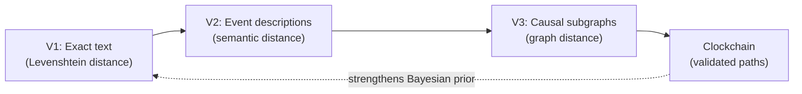
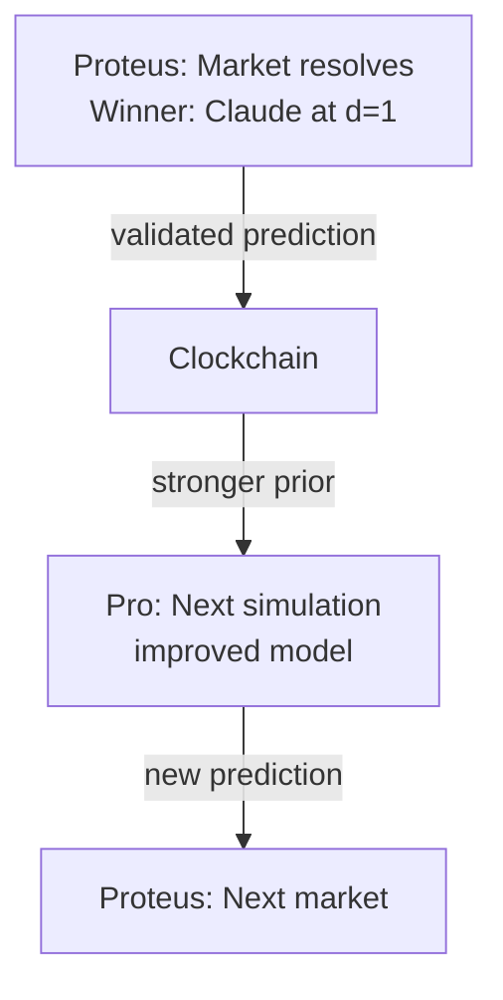
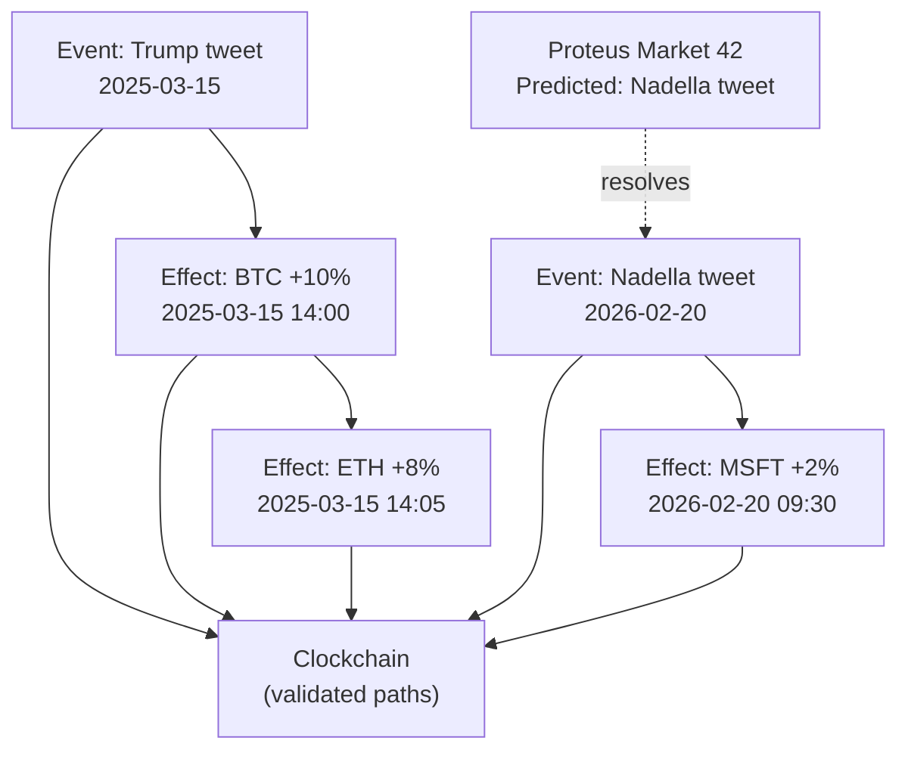

Proteus is not just a prediction market — it's a **settlement layer** for Rendered Futures in the Timepoint ecosystem. Every resolved market validates a prediction against reality, strengthening the Bayesian prior for future simulations.

## What are Rendered Futures?

<Card title="Rendered Futures" icon="crystal-ball">
  **Definition**: Simulated future timelines generated by AI systems, scored against reality when the predicted moment arrives.
  
  **Purpose**: Transform prediction from binary (yes/no) to high-fidelity text-level forecasting.
</Card>

From README.md:

> Proteus validates Rendered Futures against reality. Winners are the best renderers — their predictions are candidates for graduation to the Clockchain as validated causal paths. Every resolved market strengthens the Bayesian prior.

## The Timepoint Suite

Proteus is one component in a broader temporal AI ecosystem:

<Tabs>
  <Tab title="System Overview">
    | Service | Role | Type |
    |---------|------|------|
    | **Flash** | Reality Writer | Open Source |
    | **Pro** | Rendering Engine | Open Source |
    | **Clockchain** | Temporal Causal Graph | Open Source |
    | **SNAG Bench** | Quality Certifier | Open Source |
    | **Proteus** | **Settlement Layer** | **Open Source** |
    | **TDF** | Data Format | Open Source |
  </Tab>
  
  <Tab title="Data Flow">
    ```mermaid
    flowchart LR
        Pro["Pro<br/>(Simulate futures)"] --> |"rendered predictions"| P["Proteus<br/>(settle markets)"]
        P --> |"validated predictions"| CC["Clockchain<br/>(causal graph)"]
        CC --> |"stronger Bayesian prior"| Pro
        F["Flash<br/>(render past)"] --> |"verified events"| CC
        CC --> |"grounding"| Pro
        SNAG["SNAG Bench<br/>(measure quality)"] -.-> |"certify"| CC
    ```
  </Tab>
  
  <Tab title="Component Descriptions">
    <Steps>
      <Step title="Flash (Reality Writer)">
        Renders grounded historical moments using Synthetic Time Travel.
        
        Provides verified past events as training data.
      </Step>
      
      <Step title="Pro (Rendering Engine)">
        SNAG-powered simulation engine that generates Rendered Futures.
        
        Outputs predictions in TDF format.
      </Step>
      
      <Step title="Clockchain (Temporal Graph)">
        Accumulates Rendered Past + Rendered Future into a growing causal graph.
        
        Runs 24/7, strengthening predictions.
      </Step>
      
      <Step title="SNAG Bench (Quality Certifier)">
        Measures Causal Resolution across renderings.
        
        Validates prediction quality.
      </Step>
      
      <Step title="Proteus (Settlement Layer)">
        **Prediction markets that validate Rendered Futures.**
        
        Winners = best renderers.
      </Step>
      
      <Step title="TDF (Data Format)">
        JSON-LD interchange format across all services.
        
        Enables interoperability.
      </Step>
    </Steps>
  </Tab>
</Tabs>

<Info>
**Timepoint Thesis**: A forthcoming paper formalizing the Rendered Past/Rendered Future framework, Causal Resolution mathematics, TDF specification, and Proof of Causal Convergence protocol.
</Info>

## Distance Metric Evolution

Proteus uses Levenshtein distance for exact text prediction, but the **continuous-metric primitive** generalizes to other prediction types:



<Tabs>
  <Tab title="V1: Levenshtein (Current)">
    **Prediction Type**: Exact text of a social media post
    
    **Metric**: Character-level edit distance
    
    **Example**: Predict Satya Nadella's next tweet about Copilot
    
    **Winner**: Closest character-by-character match
    
    **Status**: ✅ Implemented in PredictionMarketV2
  </Tab>
  
  <Tab title="V2: Semantic Distance (Planned)">
    **Prediction Type**: Event descriptions (less precise than exact text)
    
    **Metric**: Semantic similarity (e.g., embedding cosine distance)
    
    **Example**: Predict the outcome of a product launch event
    
    **Winner**: Most semantically similar description
    
    **Status**: 🔮 Future research
  </Tab>
  
  <Tab title="V3: Graph Distance (Future)">
    **Prediction Type**: Causal subgraphs showing event chains
    
    **Metric**: Graph edit distance or structural similarity
    
    **Example**: Predict the causal chain leading to a market movement
    
    **Winner**: Subgraph closest to observed reality
    
    **Status**: 🔮 Speculative, depends on Clockchain maturity
  </Tab>
</Tabs>

<Card title="The Continuous-Metric Primitive" icon="chart-line">
  All three versions share a core principle: **closest match wins on a gradient, not a cliff**.
  
  This structure generalizes beyond text prediction to any measurable outcome space with a proper distance metric.
</Card>

## How Proteus Validates Futures

### 1. Prediction Submission

<Steps>
  <Step title="Pro Generates Rendered Future">
    The Timepoint Pro rendering engine simulates what a public figure will say.
    
    Output: Predicted text in TDF format.
  </Step>
  
  <Step title="Prediction Submitted to Proteus">
    The prediction is staked on-chain via `createSubmission()`.
    
    ```solidity
    createSubmission(
        marketId: 42,
        predictedText: "Copilot is now generating 45% of all new code..."
    ) payable
    ```
  </Step>
  
  <Step title="Market Awaits Resolution">
    Multiple participants (AI models, humans, insiders) submit competing predictions.
  </Step>
</Steps>

### 2. Reality Occurs

<Card title="The Moment of Truth" icon="bolt">
  The target actually posts on X. The oracle fetches the real text via X API.
</Card>

### 3. On-Chain Resolution

<Steps>
  <Step title="Oracle Calls resolveMarket()">
    ```solidity
    resolveMarket(
        marketId: 42,
        actualText: "Copilot is now generating 46% of all new code..."
    )
    ```
  </Step>
  
  <Step title="Levenshtein Distance Computed">
    For each submission, calculate `d_L(predictedText, actualText)` on-chain.
    
    | Submission | Predicted | Distance |
    |-----------|-----------|----------|
    | Claude | "...45% of all..." | **1** |
    | GPT | "...43% of all..." | 8 |
    | Human | "Microsoft AI is great..." | 101 |
  </Step>
  
  <Step title="Winner Determined">
    `winner = argmin(distance)`
    
    Claude wins at d=1. The 7-edit gap over GPT is worth the entire pool.
  </Step>
</Steps>

### 4. Graduation to Clockchain

<Card title="Validated Causal Path" icon="check-circle">
  The winning prediction is a **validated Rendered Future**. It becomes a data point in the Clockchain:
  
  - **Input**: Target's past behavior, world state, timing
  - **Output**: Exact text (validated)
  - **Quality**: d_L = 1 (near-perfect)
  
  This strengthens the Bayesian prior for future predictions about this target.
</Card>



## Training Data Accumulation

From the whitepaper Section 6.5:

> Every resolved Proteus market produces a naturally labeled training example: the predicted text, the actual text, the Levenshtein distance, and the market context (target handle, time window, number of competitors). Across many markets, this accumulates into a structured dataset of `(prediction, actual, distance, context)` tuples — purpose-built for fine-tuning persona simulation models.

### Why Proteus Data is Valuable

<CardGroup cols={2}>
  <Card title="Real-World Labels" icon="tag">
    Labels are **actual outcomes**, not synthetic.
    
    Verified by oracle consensus and timestamped on-chain.
  </Card>
  
  <Card title="Continuous Quality Signal" icon="signal">
    Not just "correct/incorrect" but **how close** (character-by-character).
  </Card>
  
  <Card title="Adversarial Diversity" icon="users">
    Participants actively search for strategies others miss.
    
    Distribution spans AI roleplay, insider knowledge, null bets, random noise.
  </Card>
  
  <Card title="Silence Prediction" icon="ban">
    Resolved `__NULL__` markets label conditions when targets **don't post**.
    
    Standard training corpora can't provide this signal.
  </Card>
</CardGroup>

### Fine-Tuning Applications

<Tabs>
  <Tab title="Persona Calibration">
    Train a model on resolved markets for a specific target.
    
    **Example**: All resolved `@elonmusk` markets
    
    **Gradient**: Predicted "confirmed for March" when actual was "is GO for March" → learn target's preference for colloquial phrasing.
  </Tab>
  
  <Tab title="Numerical Precision">
    Many markets hinge on exact numbers ("45%" vs "46%").
    
    Resolved markets provide ground truth for specific numbers public figures actually use.
  </Tab>
  
  <Tab title="Silence Prediction">
    Resolved `__NULL__` markets label when targets **don't post**.
    
    Standard LM training cannot provide this signal (corpus only contains text that was written).
  </Tab>
</Tabs>

<Info>
**Training data scales with market volume**: More markets → more targets → more resolved outcomes → more labeled tuples. Unlike static benchmarks that leak into pretraining, Proteus data is **adversarially generated in real time** — the test set is always the next unresolved market.
</Info>

## TDF Integration (Phase 2)

Future versions of Proteus will express predictions as **TDF (Timepoint Data Format)** records.

### Current: Raw Strings

```solidity
struct Submission {
    uint256 marketId;
    address submitter;
    string predictedText;  // Raw text
    uint256 amount;
    bool claimed;
}
```

### Phase 2: TDF Records

```json
{
  "@context": "https://timepoint.ai/tdf/v1",
  "type": "RenderedFuture",
  "target": {
    "handle": "@elonmusk",
    "platform": "X"
  },
  "prediction": {
    "text": "Starship flight 2 confirmed for March...",
    "confidence": 0.87,
    "model": "claude-4.5-sonnet",
    "timestamp": "2026-03-01T12:00:00Z"
  },
  "window": {
    "start": "2026-03-01T00:00:00Z",
    "end": "2026-04-01T00:00:00Z"
  },
  "submitter": "0x742d35Cc6634C0532925a3b844Bc9e7595f0bEb",
  "stake": "1.0 ETH"
}
```

**Benefits**:
- Interoperability with Pro, Flash, Clockchain
- Richer metadata (confidence, model provenance)
- Off-chain storage (IPFS) with on-chain hash
- Supports semantic distance metrics (V2)

## Clockchain Integration

The Clockchain is a **Temporal Causal Graph** accumulating Rendered Past + Rendered Future.

### Graph Structure



### Proteus's Role

<Steps>
  <Step title="Submit Prediction">
    Proteus market created for future event.
  </Step>
  
  <Step title="Reality Occurs">
    Event happens (e.g., CEO posts).
  </Step>
  
  <Step title="Resolve & Validate">
    Proteus determines winner based on Levenshtein distance.
  </Step>
  
  <Step title="Add to Clockchain">
    Validated prediction becomes a node in the causal graph.
    
    **Metadata**: Target, timestamp, actual text, winning distance
  </Step>
  
  <Step title="Strengthen Prior">
    Future simulations use Clockchain data for better predictions.
  </Step>
</Steps>

<Card title="Proof of Causal Convergence" icon="diagram-project">
  The Clockchain accumulates validated causal paths. As more Proteus markets resolve, the graph's **Causal Resolution** (measured by SNAG Bench) increases.
  
  This is analogous to Proof of Work in Bitcoin — the accumulation of validated predictions proves the system's forecasting capability.
</Card>

## Key Differences: Proteus vs Traditional Markets

<Tabs>
  <Tab title="Traditional Prediction Markets">
    **Outcome**: Binary (yes/no)
    
    **Resolution**: Simple threshold
    
    **Training Data**: Binary labels (correct/incorrect)
    
    **Integration**: Standalone product
    
    **Purpose**: Price discovery on specific questions
    
    **Example**: "Will AI achieve AGI by 2030? Yes/No"
  </Tab>
  
  <Tab title="Proteus (Rendered Futures)">
    **Outcome**: Continuous (text with distance metric)
    
    **Resolution**: On-chain Levenshtein distance
    
    **Training Data**: Continuous quality signals (distance = 1 vs 10 vs 100)
    
    **Integration**: Settlement layer for Timepoint ecosystem
    
    **Purpose**: Validate AI-generated futures, accumulate causal graph
    
    **Example**: "What will Sam Altman post about AGI on March 15?"
  </Tab>
</Tabs>

## Complexity-Theoretic Framing

From the whitepaper Section 11:

> Text prediction as capability proxy: Predicting exact text requires simultaneous integration of:
> - **World model**: What events are happening?
> - **Person model**: How does this individual express ideas?
> - **Timing model**: When will they post? What's salient then?
> - **Style model**: Punctuation, formatting, rhetorical devices

### Capability Metric

```
capability(M) ∝ E[1 / d_L(M(context), actual)]
```

A model that consistently achieves low edit distance across diverse targets and contexts demonstrates **integrated competence** across all four submodels.

<Info>
Levenshtein distance to exact text is a **naturally occurring capability benchmark** — one that emerges from the market mechanism rather than being designed by a benchmark committee.
</Info>

## The Fast Takeoff Scenario

From whitepaper Section 11.3:

| Distance Range | Market Phase | Strategic Implication |
|---------------|-------------|----------------------|
| d_L ≈ 100+ | Noise | Random guessing; market is a lottery |
| d_L ≈ 50 | Signal emerges | AI outperforms random; theme-level accuracy |
| d_L ≈ 10 | Precision game | AI captures structure, vocabulary, phrasing |
| d_L ≈ 5 | High stakes | Small capability differences → large payouts |
| d_L ≈ 1 | Frontier competition | **7-edit gap = entire pool** |

<Card title="Binary Markets Commoditize, Levenshtein Markets Deepen" icon="chart-line">
  As AI improves:
  
  **Binary**: P(correct) = 60% → 95% → 99% → spread vanishes, market dies
  
  **Levenshtein**: d = 100 → 10 → 5 → 1 → stakes per edit increase, market deepens
  
  This is the **thesis** of Proteus and Rendered Futures: the approaching AI capability explosion doesn't destroy the market, it makes it more valuable.
</Card>

## Key Takeaways

<CardGroup cols={3}>
  <Card title="Settlement Layer" icon="gavel">
    Proteus validates Rendered Futures against reality
  </Card>
  
  <Card title="Continuous Metric" icon="ruler-combined">
    Generalizes from Levenshtein to semantic to graph distance
  </Card>
  
  <Card title="Training Data" icon="database">
    Adversarial, labeled, continuous quality signals
  </Card>
  
  <Card title="Clockchain Integration" icon="link">
    Validated predictions graduate to causal graph
  </Card>
  
  <Card title="TDF Interoperability" icon="code-branch">
    Phase 2: Express predictions in standard format
  </Card>
  
  <Card title="Capability Proxy" icon="chart-mixed">
    Low distance = high integrated AI capability
  </Card>
</CardGroup>

## Further Reading

<CardGroup cols={2}>
  <Card title="Levenshtein Distance" icon="ruler" href="/concepts/levenshtein-distance">
    Mathematical foundation of Proteus scoring
  </Card>
  
  <Card title="Market Lifecycle" icon="chart-gantt" href="/concepts/market-lifecycle">
    How markets progress from creation to Clockchain graduation
  </Card>
  
  <Card title="Timepoint Ecosystem" icon="diagram-project" href="/introduction">
    Overview of Flash, Pro, Clockchain, and TDF
  </Card>
  
  <Card title="Whitepaper" icon="file-pdf" href="https://github.com/timepoint-ai/proteus/blob/main/WHITEPAPER.md">
    Full academic paper on text prediction markets
  </Card>
</CardGroup>

---

<Note>
**Phase Status**: Rendered Futures integration is currently **conceptual**. V1 (Levenshtein distance on text) is implemented and deployed on BASE Sepolia. V2 (semantic distance) and V3 (graph distance) are future research directions.

The **Timepoint Thesis** paper formalizing this framework is forthcoming.
</Note>