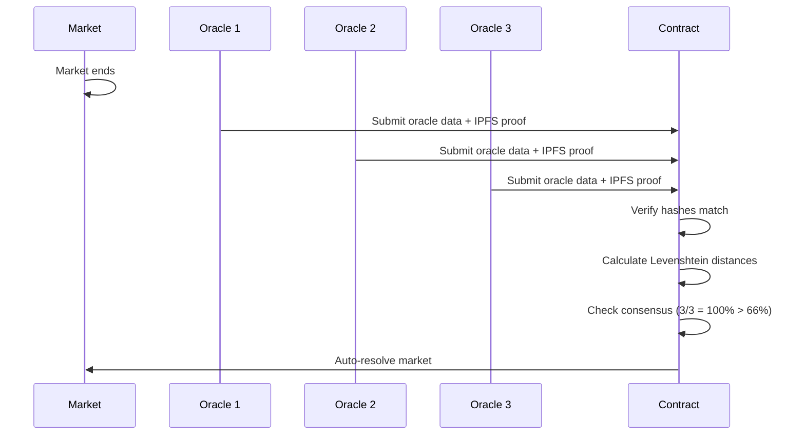

## Overview

The `DecentralizedOracle` contract enables trustless resolution of prediction markets through a consensus mechanism. Multiple oracle nodes independently verify the actual text posted by public figures and reach consensus on the correct market outcome.

**Contract Address**: `0x7EF22e27D44E3f4Cc2f133BB4ab2065D180be3C1` (BASE Sepolia)

<Note>
**Current Status**: The contract is deployed but resolution is currently centralized (single EOA). The X API pay-per-use model (launched Feb 2026) now makes multi-oracle verification economically viable. Decentralized resolution is planned for production.
</Note>

## Key Features

<CardGroup cols={2}>
  <Card title="Consensus-Based" icon="handshake">
    Requires 3+ validators to reach 66% consensus threshold
  </Card>
  <Card title="On-Chain Validation" icon="chain">
    Levenshtein distance calculated on-chain for transparency
  </Card>
  <Card title="Proof Verification" icon="image">
    IPFS screenshot hashes provide cryptographic proof
  </Card>
  <Card title="Auto-Resolution" icon="bolt">
    Markets auto-resolve when all submissions reach consensus
  </Card>
</CardGroup>

## Architecture

DecentralizedOracle.sol:24-50
```solidity
contract DecentralizedOracle is ReentrancyGuard {
    using Strings for uint256;
    
    struct OracleData {
        string actualText;
        string screenshotIPFS;
        bytes32 textHash;
        uint256 levenshteinDistance;
        address[] validators;
        mapping(address => bool) hasValidated;
        bool consensusReached;
    }
    
    struct MarketOracleData {
        mapping(bytes32 => OracleData) submissions; // submissionId => OracleData
        bytes32[] submissionIds;
        uint256 totalValidations;
        bool isResolved;
    }
    
    IEnhancedPredictionMarket public predictionMarket;
    INodeRegistry public nodeRegistry;
    
    mapping(bytes32 => MarketOracleData) public marketOracles;
    
    uint256 public constant MIN_VALIDATORS = 3;
    uint256 public constant CONSENSUS_THRESHOLD = 66; // 66%
}
```

## Constants

| Constant | Value | Description |
|----------|-------|-------------|
| `MIN_VALIDATORS` | 3 | Minimum number of validators required for consensus |
| `CONSENSUS_THRESHOLD` | 66 | Percentage agreement required (66%) |

## Oracle Workflow



## Core Functions

### submitOracleData

Oracle nodes submit validated data for a specific submission after market expiry.

<ParamField path="marketId" type="bytes32">
  The market ID
</ParamField>

<ParamField path="submissionId" type="bytes32">
  The submission ID being validated
</ParamField>

<ParamField path="actualText" type="string">
  The actual text posted by the public figure
</ParamField>

<ParamField path="screenshotIPFS" type="string">
  IPFS hash of the screenshot proof
</ParamField>

<ParamField path="predictedText" type="string">
  The predicted text from this submission (for distance calculation)
</ParamField>

DecentralizedOracle.sol:86-151
```solidity
function submitOracleData(
    bytes32 marketId,
    bytes32 submissionId,
    string calldata actualText,
    string calldata screenshotIPFS,
    string calldata predictedText
) external nonReentrant {
    require(nodeRegistry.isActiveNode(msg.sender), "Not an active oracle node");
    
    // Verify market exists and is expired but not resolved
    (,, uint256 endTime, bool resolved,,) = predictionMarket.getMarket(marketId);
    require(endTime > 0, "Market does not exist");
    require(block.timestamp > endTime, "Market not yet expired");
    require(!resolved, "Market already resolved");
    
    MarketOracleData storage marketData = marketOracles[marketId];
    OracleData storage oracleData = marketData.submissions[submissionId];
    
    // Ensure oracle hasn't already validated this submission
    require(!oracleData.hasValidated[msg.sender], "Oracle already validated this submission");
    
    // Calculate Levenshtein distance on-chain
    uint256 distance = calculateLevenshteinDistance(actualText, predictedText);
    
    // First submission for this submissionId
    if (oracleData.validators.length == 0) {
        oracleData.actualText = actualText;
        oracleData.screenshotIPFS = screenshotIPFS;
        oracleData.textHash = keccak256(abi.encodePacked(actualText));
        oracleData.levenshteinDistance = distance;
        marketData.submissionIds.push(submissionId);
    } else {
        // Verify consistency with previous submissions
        require(
            keccak256(abi.encodePacked(actualText)) == oracleData.textHash,
            "Text hash mismatch with previous submissions"
        );
        require(
            keccak256(abi.encodePacked(screenshotIPFS)) == keccak256(abi.encodePacked(oracleData.screenshotIPFS)),
            "Screenshot IPFS hash mismatch"
        );
    }
    
    // Record validation
    oracleData.validators.push(msg.sender);
    oracleData.hasValidated[msg.sender] = true;
    marketData.totalValidations++;
    
    emit OracleDataSubmitted(
        marketId,
        submissionId,
        msg.sender,
        actualText,
        screenshotIPFS,
        distance
    );
    
    // Check for consensus
    if (oracleData.validators.length >= MIN_VALIDATORS && !oracleData.consensusReached) {
        oracleData.consensusReached = true;
        emit ConsensusReached(marketId, submissionId, oracleData.validators.length);
        
        // Try to auto-resolve if all submissions have consensus
        _tryAutoResolve(marketId);
    }
}
```

**Requirements**:
- Caller must be an active oracle node (verified by NodeRegistry)
- Market must be expired but not yet resolved
- Oracle hasn't already validated this submission
- If not first validator, actual text and IPFS hash must match previous submissions

**Events**: 
- `OracleDataSubmitted(bytes32 indexed marketId, bytes32 indexed submissionId, address indexed oracle, string actualText, string screenshotIPFS, uint256 levenshteinDistance)`
- `ConsensusReached(bytes32 indexed marketId, bytes32 indexed submissionId, uint256 validatorCount)`

### calculateLevenshteinDistance

Calculate the edit distance between predicted and actual text on-chain.

<ParamField path="a" type="string">
  First string (predicted text)
</ParamField>

<ParamField path="b" type="string">
  Second string (actual text)
</ParamField>

DecentralizedOracle.sol:157-202
```solidity
function calculateLevenshteinDistance(
    string memory a,
    string memory b
) public pure returns (uint256) {
    bytes memory bytesA = bytes(a);
    bytes memory bytesB = bytes(b);
    
    uint256 lenA = bytesA.length;
    uint256 lenB = bytesB.length;
    
    // Handle empty strings
    if (lenA == 0) return lenB;
    if (lenB == 0) return lenA;
    
    // For gas efficiency, limit string length
    require(lenA <= 280 && lenB <= 280, "Strings too long for on-chain calculation");
    
    // Create a 2D array for dynamic programming
    uint256[][] memory dp = new uint256[][](lenA + 1);
    for (uint256 i = 0; i <= lenA; i++) {
        dp[i] = new uint256[](lenB + 1);
    }
    
    // Initialize base cases
    for (uint256 i = 0; i <= lenA; i++) {
        dp[i][0] = i;
    }
    for (uint256 j = 0; j <= lenB; j++) {
        dp[0][j] = j;
    }
    
    // Fill the dp table
    for (uint256 i = 1; i <= lenA; i++) {
        for (uint256 j = 1; j <= lenB; j++) {
            uint256 cost = bytesA[i - 1] == bytesB[j - 1] ? 0 : 1;
            
            uint256 deletion = dp[i - 1][j] + 1;
            uint256 insertion = dp[i][j - 1] + 1;
            uint256 substitution = dp[i - 1][j - 1] + cost;
            
            dp[i][j] = _min(_min(deletion, insertion), substitution);
        }
    }
    
    return dp[lenA][lenB];
}
```

**Returns**: The edit distance (number of insertions, deletions, substitutions needed to transform string a into string b)

**Gas Cost**: O(m*n) where m and n are string lengths. Strings limited to 280 characters for gas efficiency.

### Auto-Resolution

When all submissions reach consensus, the market auto-resolves to the submission with the lowest Levenshtein distance.

DecentralizedOracle.sol:207-241
```solidity
function _tryAutoResolve(bytes32 marketId) private {
    MarketOracleData storage marketData = marketOracles[marketId];
    
    if (marketData.isResolved) return;
    
    // Check if we have enough consensus on submissions
    uint256 lowestDistance = type(uint256).max;
    bytes32 winningSubmissionId;
    bool canResolve = true;
    
    for (uint256 i = 0; i < marketData.submissionIds.length; i++) {
        bytes32 submissionId = marketData.submissionIds[i];
        OracleData storage oracleData = marketData.submissions[submissionId];
        
        // All submissions need consensus
        if (!oracleData.consensusReached) {
            canResolve = false;
            break;
        }
        
        // Track submission with lowest Levenshtein distance
        if (oracleData.levenshteinDistance < lowestDistance) {
            lowestDistance = oracleData.levenshteinDistance;
            winningSubmissionId = submissionId;
        }
    }
    
    // Auto-resolve if all submissions have consensus
    if (canResolve && marketData.submissionIds.length > 0) {
        marketData.isResolved = true;
        predictionMarket.resolveMarket(marketId, winningSubmissionId);
        
        emit MarketAutoResolved(marketId, winningSubmissionId, lowestDistance);
    }
}
```

**Logic**:
1. Verify all submissions have reached consensus (3+ validators each)
2. Find submission with lowest Levenshtein distance
3. Resolve market to that submission
4. Emit `MarketAutoResolved` event

## View Functions

### getOracleData

Get oracle validation data for a specific submission.

<ParamField path="marketId" type="bytes32">
  The market ID
</ParamField>

<ParamField path="submissionId" type="bytes32">
  The submission ID
</ParamField>

DecentralizedOracle.sol:246-264
```solidity
function getOracleData(
    bytes32 marketId,
    bytes32 submissionId
) external view returns (
    string memory actualText,
    string memory screenshotIPFS,
    uint256 levenshteinDistance,
    uint256 validatorCount,
    bool consensusReached
) {
    OracleData storage data = marketOracles[marketId].submissions[submissionId];
    return (
        data.actualText,
        data.screenshotIPFS,
        data.levenshteinDistance,
        data.validators.length,
        data.consensusReached
    );
}
```

### hasOracleValidated

Check if a specific oracle has already validated a submission.

DecentralizedOracle.sol:269-275
```solidity
function hasOracleValidated(
    bytes32 marketId,
    bytes32 submissionId,
    address oracle
) external view returns (bool) {
    return marketOracles[marketId].submissions[submissionId].hasValidated[oracle];
}
```

## Events

```solidity
event OracleDataSubmitted(
    bytes32 indexed marketId,
    bytes32 indexed submissionId,
    address indexed oracle,
    string actualText,
    string screenshotIPFS,
    uint256 levenshteinDistance
);

event ConsensusReached(
    bytes32 indexed marketId,
    bytes32 indexed submissionId,
    uint256 validatorCount
);

event MarketAutoResolved(
    bytes32 indexed marketId,
    bytes32 indexed winningSubmissionId,
    uint256 lowestDistance
);
```

## Oracle Node Requirements

To participate as an oracle node:

1. **Register as Node Operator** via NodeRegistry contract
2. **Maintain Active Status** through regular heartbeat calls
3. **Access X API** for post verification (pay-per-use model)
4. **IPFS Storage** for screenshot proof hosting
5. **Gas Reserves** for submitting validation transactions

## X API Integration

With X's new pay-per-use API (launched Feb 2026), oracle nodes can:

```javascript
// Example X API verification workflow
const { TwitterApi } = require('twitter-api-v2');

async function verifyPost(handle, postId, expectedText) {
  const client = new TwitterApi({
    appKey: process.env.X_API_KEY,
    appSecret: process.env.X_API_SECRET,
  });
  
  // Fetch the tweet by ID (pay-per-use)
  const tweet = await client.v2.singleTweet(postId, {
    'tweet.fields': ['created_at', 'author_id', 'text']
  });
  
  // Verify authorship matches expected handle
  const author = await client.v2.user(tweet.data.author_id);
  if (author.data.username !== handle.replace('@', '')) {
    throw new Error('Author mismatch');
  }
  
  // Take screenshot and upload to IPFS
  const screenshotBuffer = await captureScreenshot(postId);
  const ipfsHash = await uploadToIPFS(screenshotBuffer);
  
  // Submit oracle data on-chain
  const tx = await oracleContract.submitOracleData(
    marketId,
    submissionId,
    tweet.data.text,
    ipfsHash,
    predictedText
  );
  
  await tx.wait();
  console.log('Oracle data submitted');
}
```

## Oracle Rewards

Oracles receive 28.6% of platform fees (2% of market volume) distributed via the [PayoutManager](/contracts/payout-manager).

**Reward Distribution**:
- If oracle contributions are tracked: **Weighted by contribution**
- If no contributions tracked: **Equal distribution** among participating oracles

Example calculation:
- Market volume: 10 ETH
- Platform fee: 0.7 ETH (7%)
- Oracle share: 0.14 ETH (28.6% of 0.7 ETH = 2% of volume)
- 3 oracles participated: 0.047 ETH each

## Usage Example

```javascript
const oracle = await ethers.getContractAt(
  "DecentralizedOracle",
  "0x7EF22e27D44E3f4Cc2f133BB4ab2065D180be3C1"
);

// Oracle node submits validation data
const actualText = "Starship flight 2 is GO for March";
const ipfsHash = "QmX8H3j9K..."; // Screenshot proof on IPFS
const predictedText = "Starship flight 2 confirmed for March";

const tx = await oracle.submitOracleData(
  marketId,
  submissionId,
  actualText,
  ipfsHash,
  predictedText
);

await tx.wait();
console.log("Oracle data submitted");

// Check oracle data
const data = await oracle.getOracleData(marketId, submissionId);
console.log("Actual text:", data.actualText);
console.log("Validators:", data.validatorCount.toString());
console.log("Consensus reached:", data.consensusReached);
console.log("Levenshtein distance:", data.levenshteinDistance.toString());
```

## Security Considerations

<CardGroup cols={2}>
  <Card title="Node Verification" icon="id-card">
    Only registered active nodes can submit oracle data
  </Card>
  <Card title="Hash Consistency" icon="fingerprint">
    All oracles must submit matching text and IPFS hashes
  </Card>
  <Card title="Double-Vote Prevention" icon="ban">
    Each oracle can only validate each submission once
  </Card>
  <Card title="Consensus Threshold" icon="handshake">
    66% agreement required before considering data valid
  </Card>
</CardGroup>

## Future Improvements

<Steps>
  <Step title="Commit-Reveal Scheme">
    Prevent oracle collusion by requiring commits before reveals
  </Step>
  <Step title="Economic Incentives">
    Slash dishonest oracles, reward accurate validators
  </Step>
  <Step title="Reputation System">
    Track oracle accuracy over time, weight votes by reputation
  </Step>
  <Step title="Dispute Resolution">
    Allow challenges to oracle consensus with stake
  </Step>
</Steps>

## Next Steps

<CardGroup cols={2}>
  <Card title="Contracts Overview" icon="scroll" href="/contracts/overview">
    View all deployed smart contracts
  </Card>
  <Card title="PredictionMarketV2" icon="chart-line" href="/contracts/prediction-market-v2">
    See how markets integrate with oracles
  </Card>
</CardGroup>
