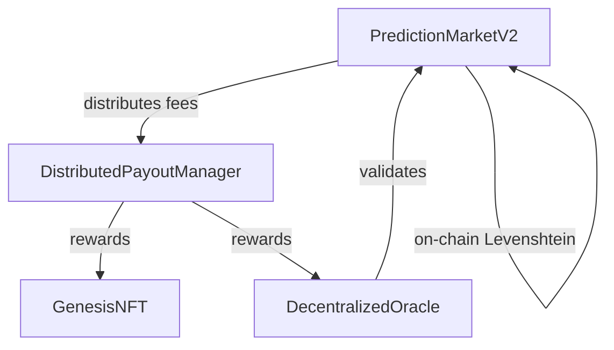

## Overview

Proteus uses a suite of smart contracts deployed on BASE Sepolia testnet to power prediction markets with on-chain winner determination. All market data lives on-chain with zero database dependencies.

<Warning>
**Testnet Only**: These contracts are deployed on BASE Sepolia testnet. Not audited. Not production-ready. Do not deploy to mainnet.
</Warning>

## Contract Architecture



## Deployed Contracts (BASE Sepolia)

| Contract | Address | Status |
|----------|---------|--------|
| **PredictionMarketV2** | `0x5174Da96BCA87c78591038DEe9DB1811288c9286` | **Active - RECOMMENDED** |
| GenesisNFT | `0x1A5D4475881B93e876251303757E60E524286A24` | 60/100 minted, finalized |
| PayoutManager | `0x88d399C949Ff2f1aaa8eA5a859Ae4d97c74f6871` | Deployed |
| DecentralizedOracle | `0x7EF22e27D44E3f4Cc2f133BB4ab2065D180be3C1` | Deployed |
| PredictionMarket (V1) | `0x667121e8f22570F2c521454D93D6A87e44488d93` | **Deprecated** |

<Info>
**Recommended**: Use **PredictionMarketV2** for all new development. It includes complete market lifecycle with on-chain winner determination via Levenshtein distance.
</Info>

## Key Features

### On-Chain Levenshtein Distance
Winner determination is fully on-chain using the Levenshtein edit distance algorithm. No off-chain computation or trust assumptions required for scoring.

```solidity
function levenshteinDistance(string memory a, string memory b) 
    public pure returns (uint256)
```

### Complete Market Lifecycle
PredictionMarketV2 implements the full market flow:

1. **Create** - Anyone can create a market (1 hour to 30 days duration)
2. **Submit** - Users stake ETH on text predictions (min 0.001 ETH)
3. **Resolve** - Owner resolves with actual text, contract calculates distances
4. **Claim** - Winner claims pool minus 7% platform fee

### Pull-Based Fee Collection
Platform fees accumulate in the contract and are withdrawn explicitly, preventing griefing attacks where malicious recipients could block payouts.

### Single Submission Refunds
Markets with only one submission auto-refund with no fee charged, preventing unfair loss when there's no competition.

## Fee Distribution

7% platform fee on total market volume, distributed across stakeholders:

| Recipient | Share | % of Volume |
|-----------|-------|-------------|
| Genesis NFT Holders | 20% of fees | 1.4% |
| Oracles | 28.6% of fees | 2.0% |
| Market Creators | 14.3% of fees | 1.0% |
| Node Operators | 14.3% of fees | 1.0% |
| Builder Pool | 28.6% of fees | 2.0% |

Fee distribution is handled by `DistributedPayoutManager.sol`.

## Security

### Static Analysis
Slither analysis completed (December 2024):
- **277 findings** triaged
- **1 real bug** found and fixed (AdvancedMarkets locked-ether)
- **PredictionMarketV2** has no high/medium severity issues

See the [full security analysis](/security-analysis) for details.

### Known Limitations
<Warning>
This is a v0 alpha prototype:
- **No external audit** - Do not use in production
- **Centralized resolution** - Single EOA resolves markets
- **No multisig** - Owner key is single EOA
- **Testnet only** - Not ready for mainnet deployment
</Warning>

## Gas Costs

| Operation | Typical Gas | Notes |
|-----------|-------------|-------|
| createMarket | ~120,000 | Creating new market |
| createSubmission | 200,000-400,000 | Depends on text length |
| resolveMarket | 1.5M-9M | Levenshtein calculation scales with text length |
| claimPayout | ~90,000 | Winner claiming funds |

<Note>
Resolution gas costs vary significantly based on submission text lengths due to the on-chain Levenshtein algorithm (O(m*n) complexity).
</Note>

## Contract Verification

All contracts are verified on Basescan. View source code:

```
https://sepolia.basescan.org/address/<CONTRACT_ADDRESS>#code
```

## Next Steps

<CardGroup cols={2}>
  <Card title="PredictionMarketV2" icon="chart-line" href="/contracts/prediction-market-v2">
    Full-featured prediction market with Levenshtein distance
  </Card>
  <Card title="GenesisNFT" icon="image" href="/contracts/genesis-nft">
    100 founder NFTs with on-chain SVG art
  </Card>
  <Card title="PayoutManager" icon="money-bill" href="/contracts/payout-manager">
    Automated fee distribution system
  </Card>
  <Card title="Oracle System" icon="eye" href="/contracts/oracle-system">
    Decentralized text validation
  </Card>
</CardGroup>
