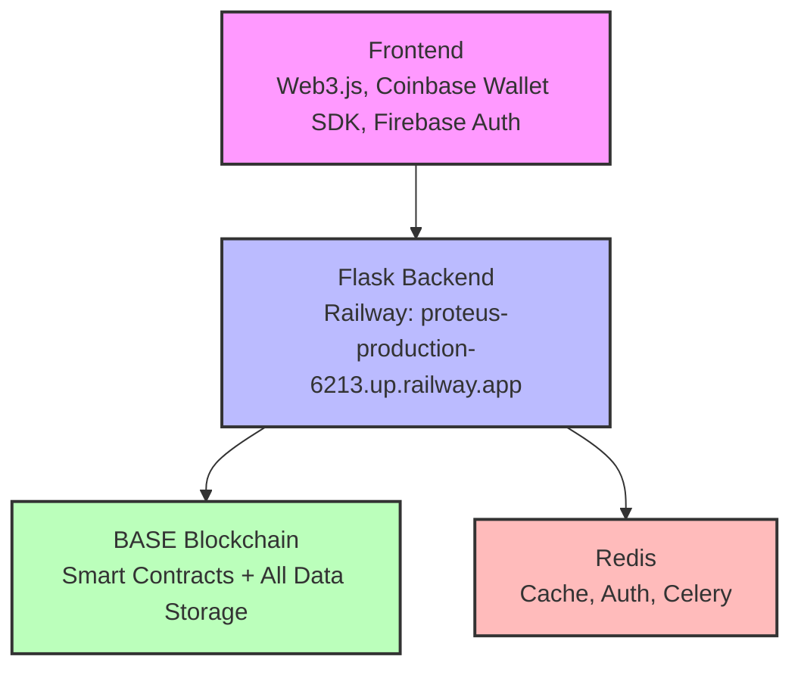
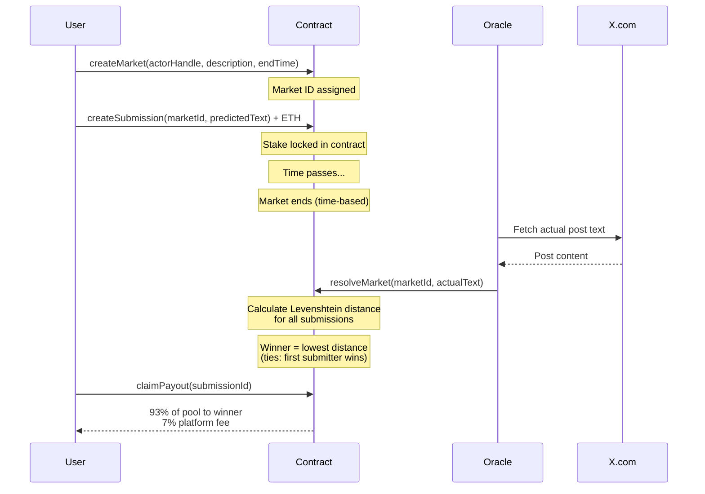

<Note>
  **v0 Alpha Architecture**: This documents the prototype architecture. Everything below the smart contract layer is scaffolding for testing the core primitive.
</Note>

## Core Primitive

The novel piece is **on-chain Levenshtein distance** as a scoring function for prediction markets. Everything else exists to make that primitive testable on BASE Sepolia.

```
                The thing that matters
                ──────────────────────
                PredictionMarketV2.sol
                - createSubmission(marketId, predictedText) payable
                - resolveMarket(marketId, actualText) onlyOwner
                - levenshteinDistance(a, b) pure → uint256
                - claimPayout(submissionId)

                Prototype scaffolding
                ─────────────────────
                Flask + Web3.py backend
                Vanilla JS frontend
                Firebase email OTP
                Redis caching
                Celery workers
```

## System Overview



The frontend is a functional prototype. The Flask backend provides API routes and admin tools. All market data lives on-chain.

## Smart Contract Stack

| Contract | Purpose | Status |
|----------|---------|--------|
| **PredictionMarketV2** | Full market lifecycle with Levenshtein resolution | **Active** |
| GenesisNFT | 100 founder NFTs with on-chain SVG art | 60 minted, finalized |
| PayoutManager | Fee distribution to stakeholders | Deployed |
| DecentralizedOracle | Text validation and Levenshtein calculation | Deployed (future use) |
| ActorRegistry | X.com actor registration (governance) | Deployed (future use) |
| NodeRegistry | Node operator staking | Deployed (future use) |
| PredictionMarket (V1) | Simple market, no resolution | **Deprecated** |
| EnhancedPredictionMarket | Full governance market logic | Future (requires active nodes) |

<Info>
  **PredictionMarketV2** is the only contract that matters right now at `0x5174Da96BCA87c78591038DEe9DB1811288c9286`.
</Info>

## Data Flow



<Steps>
  <Step title="Market Creation">
    A user creates a market specifying:
    - Actor handle (e.g., `@elonmusk`)
    - Description (what the market is about)
    - End time (Unix timestamp)
  </Step>

  <Step title="User Submissions">
    Users submit predictions with ETH stakes:
    - Predicted text (max 280 characters)
    - ETH stake (minimum specified by market)
    - Stake is locked in the contract
  </Step>

  <Step title="Market Ends">
    The market closes automatically when the end time is reached. No more submissions are accepted.
  </Step>

  <Step title="Oracle Resolution">
    An oracle (currently a single EOA) fetches the actual text from X.com and calls `resolveMarket()`.
  </Step>

  <Step title="On-chain Scoring">
    The contract calculates Levenshtein distance between each prediction and the actual text:
    - Distance = minimum number of single-character edits
    - Winner = submission with lowest distance
    - Ties are broken by submission order (first wins)
  </Step>

  <Step title="Payout">
    The winner claims their payout:
    - 93% of total pool goes to winner
    - 7% platform fee is distributed to stakeholders
  </Step>
</Steps>

## Resolution Model (Centralized MVP)

<Warning>
  Currently: **single EOA calls `resolveMarket(marketId, actualText)`**. This is the biggest centralization risk and the most important thing to fix before real deployment.
</Warning>

### Current Implementation

- Single owner address has resolution authority
- Owner fetches text from X.com API
- Owner submits actual text on-chain
- Contract calculates winners automatically

### Planned Upgrade Path

<Steps>
  <Step title="Commit-Reveal Oracle Consensus">
    Multiple oracles submit hashed commits, then reveal. Majority wins.
  </Step>

  <Step title="Slashing for Dishonest Oracles">
    Oracles stake tokens. Dishonest submissions result in slashed stakes.
  </Step>

  <Step title="Screenshot Proof Required">
    Oracles must submit IPFS-pinned screenshots as proof of the actual text.
  </Step>
</Steps>

<Info>
  **X API Update (Feb 2026)**: X.com now offers [pay-per-use API access](https://developer.x.com/) with no monthly subscriptions. This makes multi-oracle verification economically viable.
</Info>

## Backend Services (Prototype)

Backend services are Python modules that support the Flask API:

```
services/
├── blockchain_base.py      # Web3 contract interactions
├── v2_resolution.py        # Market resolution service (owner-based)
├── event_hooks.py          # Webhook event emitter (market.resolved, etc.)
├── auth_store.py           # Redis-backed nonce/OTP storage
├── xcom_api_service.py     # X.com API + Playwright screenshots
├── text_analysis.py        # Levenshtein distance (Python side)
├── cache_manager.py        # Redis caching for RPC responses
├── firebase_auth.py        # Email OTP authentication
├── embedded_wallet.py      # Coinbase wallet shim (PBKDF2, NOT production-safe)
└── monitoring.py           # Health checks

utils/
├── api_errors.py           # Standardized error responses
├── logging_config.py       # Structured logging (structlog)
└── request_context.py      # Request ID middleware
```

### Key Services

<AccordionGroup>
  <Accordion title="blockchain_base.py">
    Core Web3.py integration for contract interactions:
    - Contract initialization with ABIs
    - Transaction signing and submission
    - Event filtering and parsing
    - Gas estimation
  </Accordion>

  <Accordion title="v2_resolution.py">
    Market resolution workflow:
    - Fetch actual text from X.com
    - Submit resolution transaction
    - Emit resolution events
    - Handle resolution failures
  </Accordion>

  <Accordion title="cache_manager.py">
    Redis caching layer:
    - Cache RPC responses (reduces blockchain calls)
    - TTL-based expiration
    - Cache invalidation on state changes
  </Accordion>

  <Accordion title="embedded_wallet.py">
    <Warning>
      Uses PBKDF2 for testnet only. **NOT production-safe.** Replace with Coinbase CDP Server Signer before mainnet.
    </Warning>
    
    Wallet generation from email:
    - Derive keypair from email + password
    - Sign transactions
    - Testnet convenience feature
  </Accordion>
</AccordionGroup>

## API Routes

All data is fetched from blockchain. **Zero database.**

```
routes/
├── api_chain.py            # /api/chain/* - blockchain queries
├── auth.py                 # /auth/* - JWT wallet auth + OTP (Redis-backed)
├── proteus.py              # /proteus/* - market operations + admin resolution
├── embedded_auth.py        # /api/embedded/* - Coinbase wallet auth
├── admin.py                # /admin/* - resolution dashboard
├── error_handlers.py       # Standardized error handling
└── ...                     # Other route modules (marketing, docs, oracles)
```

### Key Endpoints

| Route | Method | Purpose |
|-------|--------|----------|
| `/api/chain/markets` | GET | List all markets |
| `/api/chain/markets/:id` | GET | Get market details |
| `/api/chain/submissions/:id` | GET | Get submission details |
| `/auth/request-otp` | POST | Request email OTP |
| `/auth/verify-otp` | POST | Verify OTP and get JWT |
| `/proteus/create-market` | POST | Create new market |
| `/proteus/submit-prediction` | POST | Submit prediction |
| `/admin/resolve` | POST | Resolve market (owner only) |

## Gas Considerations

Levenshtein distance computation is the expensive operation:

| String Length | Approximate Gas | Cost at 5 gwei |
|---------------|-----------------|----------------|
| 50 chars each | ~400,000 | $0.002 |
| 100 chars each | ~1,500,000 | $0.008 |
| 280 chars each | ~9,000,000 | $0.045 |

<Warning>
  Predictions are **capped at 280 characters** (tweet length) to prevent block gas limit DoS attacks.
</Warning>

### Optimization Strategies

- Early termination if distance exceeds current minimum
- Gas-efficient string comparison (minimize SLOAD operations)
- Batch resolution for multiple markets (future)

## Caching Strategy (Redis)

Redis caches RPC responses and stores authentication state:

| Data Type | TTL | Purpose |
|-----------|-----|----------|
| Actors | 5 min | X.com actor metadata |
| Markets | 30 sec | Market state and submissions |
| Stats | 10 sec | Platform statistics |
| Auth nonces | 5 min | Wallet authentication |
| OTP codes | 5 min | Email verification |
| Gas price | 5 sec | Gas estimation |

### Cache Invalidation

- Invalidate on-chain state changes (market created, resolved, etc.)
- TTL-based expiration for stale data
- Manual flush for emergency updates

## Security Posture

### Smart Contracts ✅

- Reentrancy guards on all payment functions (OpenZeppelin)
- No upgradeable proxies (immutable deployments)
- Slither static analysis complete (1 real bug found and fixed)

<Warning>
  **No external audit** — This is the biggest gap before mainnet.
</Warning>

### Backend ⚠️

- JWT wallet authentication with nonce-based replay protection
- Redis-backed OTP storage with TTL expiry
- OTP rate limiting (3 per 15 min) and brute-force protection (5 attempts)
- Flask-Limiter rate limiting on all endpoints

<Warning>
  **Embedded wallet uses PBKDF2 shim** — Testnet only, not production-safe.
</Warning>

### Known Centralization Risks

<Warning>
  Critical issues to address before mainnet:
  
  1. **Single EOA resolves markets** — Owner-based resolution is centralized
  2. **No multisig on contract owner key** — Single point of failure
  3. **Backend is a single Flask instance** — No redundancy
</Warning>

## Network Configuration

### BASE Sepolia (Testnet) — Current

- **Chain ID**: 84532
- **RPC**: `https://sepolia.base.org`
- **Explorer**: [sepolia.basescan.org](https://sepolia.basescan.org)
- **Faucet**: [Coinbase Faucet](https://www.coinbase.com/faucets/base-ethereum-sepolia-faucet)

### BASE Mainnet — Not Deployed

- **Chain ID**: 8453
- **RPC**: Requires Alchemy/QuickNode
- **Explorer**: [basescan.org](https://basescan.org)

<Warning>
  Do not deploy to mainnet without completing security prerequisites. See [Deployment guide](/development/deployment).
</Warning>

## Technology Stack

### Blockchain

- **Network**: BASE (Coinbase L2, OP Stack)
- **Contracts**: Solidity 0.8.20
- **Libraries**: OpenZeppelin Contracts 5.4.0
- **Development**: Hardhat 2.26.1
- **Testing**: Hardhat + Chai

### Backend

- **Language**: Python 3.11+
- **Framework**: Flask 3.1.1
- **Web Server**: gunicorn 23.0.0
- **Blockchain**: Web3.py 7.12.1
- **Queue**: Celery 5.5.3 + Redis
- **Cache**: Redis 6.2.0
- **Auth**: JWT + Firebase

### Frontend

- **Web3**: Web3.js
- **Wallet**: Coinbase Wallet SDK
- **Auth**: Firebase Auth
- **UI**: Vanilla JavaScript (no framework)

## Fee Distribution

The 7% platform fee is distributed across stakeholders:

| Recipient | Share | Amount per 100 ETH Volume |
|-----------|-------|---------------------------|
| Genesis NFT Holders | 20% | 1.4 ETH |
| Oracles | 28.6% | 2.0 ETH |
| Market Creators | 14.3% | 1.0 ETH |
| Node Operators | 14.3% | 1.0 ETH |
| Builder Pool | 28.6% | 2.0 ETH |
| **Total** | **100%** | **7.0 ETH** |

Fees are collected in the `DistributedPayoutManager` contract and distributed according to this schedule.

## Next Steps

<CardGroup cols={2}>
  <Card title="Local Setup" icon="laptop-code" href="/development/local-setup">
    Set up your development environment
  </Card>
  <Card title="Testing" icon="flask" href="/development/testing">
    Run the comprehensive test suite
  </Card>
  <Card title="Deployment" icon="rocket" href="/development/deployment">
    Deploy contracts and backend
  </Card>
  <Card title="Smart Contracts" icon="file-contract" href="/contracts/prediction-market-v2">
    Dive into contract details
  </Card>
</CardGroup>