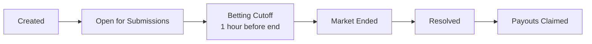

Creating a new prediction market on Proteus is simple and only costs gas fees. Markets are created on-chain via the `PredictionMarketV2` contract deployed on BASE Sepolia.

## Overview

When you create a market, you specify:
- **Actor Handle**: The X.com (Twitter) handle to track
- **Duration**: How long until the market closes (1-720 hours)

Market creation is **free** — you only pay gas fees. Players stake ETH when submitting predictions.

## Prerequisites

<Steps>
  <Step title="Connect Your Wallet">
    You need a connected wallet (MetaMask or Coinbase Embedded Wallet) with BASE Sepolia ETH for gas fees.
    
    Get testnet ETH from the [BASE Sepolia Faucet](https://www.coinbase.com/faucets/base-ethereum-sepolia-faucet).
  </Step>
  
  <Step title="Navigate to Create Market">
    Go to the market creation page in the Proteus app.
  </Step>
</Steps>

## Creating a Market

<Steps>
  <Step title="Enter Actor Handle">
    Specify the X.com handle to track (e.g., `elonmusk`, `sama`, `zuck`).
    
    - Do not include the `@` symbol
    - Only letters, numbers, and underscores allowed
    - Must be a valid X.com handle
  </Step>
  
  <Step title="Set Market Duration">
    Choose how long the market will accept predictions:
    
    - **Minimum**: 1 hour
    - **Maximum**: 720 hours (30 days)
    - **Default**: 24 hours
    
    <Note>
      Markets have a **1-hour betting cutoff** before the end time. Submissions stop 1 hour before `endTime` to prevent last-second manipulation.
    </Note>
  </Step>
  
  <Step title="Submit Transaction">
    Click **Create Market on BASE** and confirm the transaction in your wallet.
    
    The `createMarket` function is called:
    
    ```solidity
    function createMarket(
        string calldata _actorHandle,
        uint256 _duration
    ) external whenNotPaused returns (uint256)
    ```
    
    You'll receive a `marketId` in the transaction receipt.
  </Step>
</Steps>

## Contract Interaction

### Using Web3.js (Frontend)

Here's how the frontend creates markets:

```javascript
class BettingContract {
    async createMarket(actorHandle, durationHours) {
        const durationSeconds = durationHours * 3600;
        
        // Call contract (NOT payable in V2)
        const tx = await this.contract.methods
            .createMarket(actorHandle, durationSeconds)
            .send({ 
                from: this.account,
                gas: 200000
            });
        
        console.log('Market created:', tx.transactionHash);
        
        // Extract market ID from event
        const marketId = tx.events.MarketCreated.returnValues.marketId;
        return { marketId, transactionHash: tx.transactionHash };
    }
}
```

### Using Python (Backend)

Creating markets via the Python backend:

```python
from web3 import Web3

# Initialize Web3
w3 = Web3(Web3.HTTPProvider('https://sepolia.base.org'))

# Load contract
contract_address = '0x5174Da96BCA87c78591038DEe9DB1811288c9286'
contract = w3.eth.contract(address=contract_address, abi=contract_abi)

# Create market
actor_handle = 'elonmusk'
duration = 24 * 3600  # 24 hours in seconds

tx_hash = contract.functions.createMarket(
    actor_handle,
    duration
).transact({
    'from': creator_address,
    'gas': 200000
})

# Wait for receipt
receipt = w3.eth.wait_for_transaction_receipt(tx_hash)
print(f'Market created: {receipt.transactionHash.hex()}')
```

## Market Lifecycle

Once created, markets go through these phases:



## Smart Contract Details

### Contract Address

**PredictionMarketV2**: `0x5174Da96BCA87c78591038DEe9DB1811288c9286` (BASE Sepolia)

### Market Struct

```solidity
struct Market {
    string actorHandle;        // Social media handle
    uint256 endTime;           // When betting closes
    uint256 totalPool;         // Total ETH in market
    bool resolved;             // Has winner been determined
    uint256 winningSubmissionId; // Winning submission ID
    address creator;           // Market creator
}
```

### Events Emitted

```solidity
event MarketCreated(
    uint256 indexed marketId,
    string actorHandle,
    uint256 endTime,
    address creator
);
```

## Validation Rules

<Warning>
  The contract enforces these validation rules:
  
  - **Duration**: Must be between 1 hour and 30 days
  - **Contract State**: Contract must not be paused
  - **Gas**: Requires ~200,000 gas for market creation
</Warning>

```solidity
if (_duration < 1 hours || _duration > 30 days) 
    revert InvalidDuration();
```

## Example Transaction

Here's a complete example creating a market for Elon Musk:

```javascript
const marketCreator = new MarketCreator();

try {
    const result = await marketCreator.createMarket('elonmusk', 24);
    
    console.log(`Market #${result.marketId} created successfully!`);
    console.log(`Transaction: ${result.transactionHash}`);
    console.log(`View: https://sepolia.basescan.org/tx/${result.transactionHash}`);
    
    // Redirect to market page
    window.location.href = `/market/${result.marketId}`;
    
} catch (error) {
    console.error('Market creation failed:', error.message);
}
```

## Querying Markets

### Get Market Details

```javascript
const marketDetails = await contract.methods
    .getMarketDetails(marketId)
    .call();

const [
    actorHandle,
    endTime,
    totalPool,
    resolved,
    winningSubmissionId,
    creator,
    submissionIds
] = marketDetails;
```

### Via API

```bash
curl https://proteus-production-6213.up.railway.app/api/chain/markets
```

Response:

```json
{
  "markets": [
    {
      "id": 0,
      "actor_address": "elonmusk",
      "start_time": 1709740800,
      "end_time": 1709827200,
      "status": "active",
      "total_volume": "5000000000000000000",
      "block_number": 12345678
    }
  ],
  "total": 1,
  "source": "blockchain"
}
```

## Best Practices

<AccordionGroup>
  <Accordion title="Choose Popular Handles">
    Select X.com handles that:
    - Post frequently (daily or multiple times per day)
    - Have predictable patterns or topics
    - Are verified accounts with authentic content
  </Accordion>
  
  <Accordion title="Set Appropriate Duration">
    - **Short duration (1-6 hours)**: For handles that tweet multiple times daily
    - **Medium duration (12-48 hours)**: Most common use case
    - **Long duration (7+ days)**: For infrequent posters or specific events
  </Accordion>
  
  <Accordion title="Consider Time Zones">
    Factor in when your target handle typically posts. Setting market end time during their active hours increases participation.
  </Accordion>
</AccordionGroup>

## Troubleshooting

<Tabs>
  <Tab title="Transaction Failed">
    **Common causes:**
    - Insufficient gas
    - Invalid duration (< 1 hour or > 30 days)
    - Contract is paused
    - Invalid character in handle
    
    **Solution:** Check your wallet has enough BASE Sepolia ETH and retry.
  </Tab>
  
  <Tab title="Market Not Appearing">
    **Possible reasons:**
    - Transaction still pending
    - Blockchain indexer delay
    - Market created on wrong network
    
    **Solution:** Wait 30-60 seconds and refresh. Check BaseScan for transaction confirmation.
  </Tab>
</Tabs>

## Next Steps

After creating a market:

1. Share the market ID with potential participants
2. Monitor submissions as they come in
3. Wait for the oracle to resolve after `endTime`
4. Check the winning submission

<Card title="Submit Predictions" icon="brain" href="/guides/submitting-predictions">
  Learn how to submit predictions and stake ETH on markets
</Card>