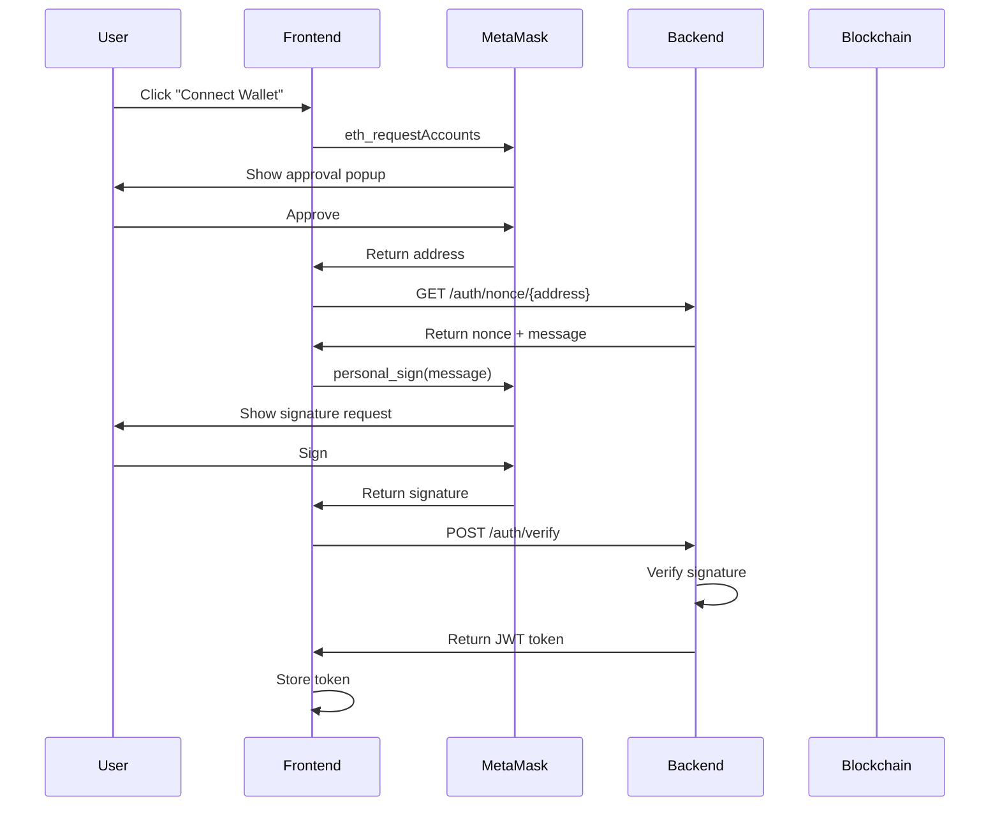
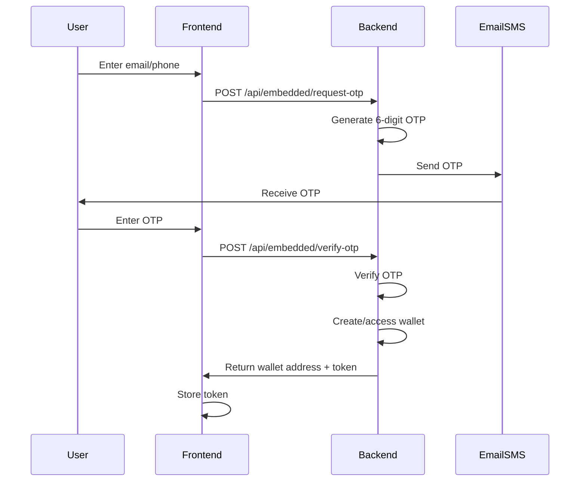

Proteus supports two wallet connection methods: **MetaMask** (for Web3-native users) and **Coinbase Embedded Wallet** (for email-based authentication). Both connect to BASE Sepolia testnet.

## Supported Wallets

<CardGroup cols={2}>
  <Card title="MetaMask" icon="wallet">
    **Best for:** Web3-native users with existing wallets
    
    - Self-custody with seed phrase
    - Direct blockchain access
    - Sign transactions in-wallet
  </Card>
  
  <Card title="Coinbase Embedded Wallet" icon="envelope">
    **Best for:** New users without crypto experience
    
    - Email/SMS authentication
    - No seed phrases to manage
    - Simplified onboarding
  </Card>
</CardGroup>

## MetaMask Setup

### Prerequisites

- Install [MetaMask extension](https://metamask.io/download/) in your browser
- Create a MetaMask account with seed phrase backup

<Steps>
  <Step title="Add BASE Sepolia Network">
    MetaMask needs to be configured for BASE Sepolia testnet:
    
    ```javascript
    await window.ethereum.request({
        method: 'wallet_addEthereumChain',
        params: [{
            chainId: '0x14a34',  // 84532 in hex
            chainName: 'BASE Sepolia',
            nativeCurrency: {
                name: 'Ethereum',
                symbol: 'ETH',
                decimals: 18
            },
            rpcUrls: ['https://sepolia.base.org'],
            blockExplorerUrls: ['https://sepolia.basescan.org']
        }]
    });
    ```
    
    Or add manually:
    - **Network Name**: BASE Sepolia
    - **RPC URL**: `https://sepolia.base.org`
    - **Chain ID**: `84532`
    - **Symbol**: `ETH`
    - **Block Explorer**: `https://sepolia.basescan.org`
  </Step>
  
  <Step title="Get Testnet ETH">
    Visit the [BASE Sepolia Faucet](https://www.coinbase.com/faucets/base-ethereum-sepolia-faucet):
    
    1. Enter your wallet address
    2. Complete CAPTCHA
    3. Receive 0.1-1.0 ETH (usually within 30 seconds)
    
    <Note>
      Testnet ETH has no real-world value. It's free and used only for testing.
    </Note>
  </Step>
  
  <Step title="Connect to Proteus">
    Click **Connect Wallet** in the Proteus app:
    
    ```javascript
    // Frontend connection code
    async function connectMetaMask() {
        if (!window.ethereum) {
            alert('MetaMask not installed');
            return;
        }
        
        try {
            // Request account access
            const accounts = await window.ethereum.request({ 
                method: 'eth_requestAccounts' 
            });
            
            const address = accounts[0];
            console.log('Connected:', address);
            
            // Initialize Web3
            const web3 = new Web3(window.ethereum);
            
            // Check network
            const chainId = await web3.eth.getChainId();
            if (chainId !== 84532) {
                await window.ethereum.request({
                    method: 'wallet_switchEthereumChain',
                    params: [{ chainId: '0x14a34' }]
                });
            }
            
            return { web3, address };
            
        } catch (error) {
            console.error('Connection failed:', error);
            throw error;
        }
    }
    ```
  </Step>
  
  <Step title="Authenticate with Signature">
    Proteus uses signature-based authentication:
    
    ```javascript
    class WalletAuth {
        async authenticate() {
            // Get nonce from server
            const response = await fetch(`/auth/nonce/${address}`);
            const { nonce, message } = await response.json();
            
            // Message format:
            // "Sign this message to authenticate with Proteus.\n\nNonce: abc123"
            
            // Request signature
            const signature = await web3.eth.personal.sign(
                message,
                address,
                '' // No password for MetaMask
            );
            
            // Verify with server
            const verifyResponse = await fetch('/auth/verify', {
                method: 'POST',
                headers: { 'Content-Type': 'application/json' },
                body: JSON.stringify({ address, signature, message })
            });
            
            const result = await verifyResponse.json();
            
            if (result.success) {
                // Store JWT token
                localStorage.setItem('auth_token', result.token);
                localStorage.setItem('wallet_address', result.address);
                
                console.log('Authenticated!');
                return result;
            }
        }
    }
    ```
    
    You'll see a MetaMask popup asking you to sign a message. **This costs no gas** — it's just a signature proving you own the address.
  </Step>
</Steps>

### MetaMask Account Changes

Proteus automatically detects account/network changes:

```javascript
if (window.ethereum) {
    // Listen for account changes
    window.ethereum.on('accountsChanged', (accounts) => {
        if (accounts.length === 0) {
            // User disconnected
            walletAuth.logout();
        } else {
            // User switched accounts
            console.log('Switched to:', accounts[0]);
            walletAuth.logout(); // Force re-authentication
        }
    });
    
    // Listen for network changes
    window.ethereum.on('chainChanged', (chainId) => {
        console.log('Network changed:', chainId);
        window.location.reload(); // Reload on network change
    });
}
```

## Coinbase Embedded Wallet Setup

Embedded wallets use email/SMS OTP — no seed phrases, no MetaMask, no blockchain knowledge required.

<Steps>
  <Step title="Click Get Started">
    On the Proteus homepage, click **Get Started** (or **Connect Wallet** if MetaMask is hidden).
  </Step>
  
  <Step title="Enter Email or Phone">
    The authentication modal appears:
    
    ```javascript
    class EmbeddedWallet {
        showAuthModal() {
            // Modal with email/phone input
            const identifier = document.getElementById('authIdentifier').value;
            
            // Detect auth method
            const authMethod = identifier.includes('@') ? 'email' : 'sms';
            
            // Request OTP
            await this.requestOTP(identifier, authMethod);
        }
    }
    ```
    
    Enter:
    - **Email**: `user@example.com`
    - **Phone**: `+1234567890` (with country code)
  </Step>
  
  <Step title="Request OTP Code">
    Click **Continue** to receive a 6-digit code:
    
    ```javascript
    async requestOTP(identifier, authMethod) {
        const response = await fetch('/api/embedded/request-otp', {
            method: 'POST',
            headers: { 'Content-Type': 'application/json' },
            body: JSON.stringify({ identifier, auth_method: authMethod })
        });
        
        const data = await response.json();
        
        if (data.success) {
            console.log('OTP sent to:', identifier);
            
            // In test mode, OTP is returned
            if (data.test_otp) {
                console.log('Test OTP:', data.test_otp);
            }
        }
    }
    ```
    
    <Warning>
      **Test Mode**: On testnet, the OTP is auto-filled in the UI. In production, it would be sent via email/SMS.
    </Warning>
  </Step>
  
  <Step title="Verify OTP">
    Enter the 6-digit code and click **Verify**:
    
    ```javascript
    async verifyOTP(identifier, otpCode) {
        const response = await fetch('/api/embedded/verify-otp', {
            method: 'POST',
            headers: { 'Content-Type': 'application/json' },
            body: JSON.stringify({ identifier, otp_code: otpCode })
        });
        
        const data = await response.json();
        
        if (data.success) {
            // Wallet created/accessed
            this.walletAddress = data.wallet_address;
            this.token = data.token;
            this.balanceUSD = data.balance_usd;
            
            // Store session
            localStorage.setItem('embeddedWalletToken', this.token);
            
            console.log('Wallet address:', this.walletAddress);
            return data;
        }
    }
    ```
    
    Your wallet is now connected! The backend creates a wallet for you using:
    - **PBKDF2 key derivation** from email/phone + salt
    - **Server-side signing** for transactions
    - **No seed phrase** to remember
  </Step>
</Steps>

### How Embedded Wallets Work

Behind the scenes, Proteus uses a simplified implementation:

```python
# Backend: Embedded wallet service
import hashlib
import hmac
from eth_account import Account

class EmbeddedWalletService:
    def create_wallet(self, identifier: str) -> dict:
        # Derive private key from identifier + salt
        salt = os.environ.get('WALLET_SALT')
        key_material = f"{identifier}:{salt}".encode()
        
        # PBKDF2 key derivation
        private_key = hashlib.pbkdf2_hmac(
            'sha256',
            key_material,
            salt.encode(),
            iterations=100000,
            dklen=32
        )
        
        # Create account
        account = Account.from_key(private_key)
        
        return {
            'address': account.address,
            'private_key': private_key.hex()  # Stored securely server-side
        }
    
    def sign_transaction(self, identifier: str, tx: dict) -> str:
        # Reconstruct wallet
        wallet = self.create_wallet(identifier)
        account = Account.from_key(wallet['private_key'])
        
        # Sign transaction
        signed_tx = account.sign_transaction(tx)
        
        return signed_tx.rawTransaction.hex()
```

<Warning>
  **Security Note**: The current implementation uses PBKDF2 key derivation as a proof-of-concept. Production would use **Coinbase CDP Server Signer** or equivalent HSM-backed service.
</Warning>

### Transaction Signing

Embedded wallets sign transactions server-side:

```javascript
class EmbeddedWallet {
    async getTransactionSigner() {
        return {
            address: this.walletAddress,
            signTransaction: async (tx) => {
                const response = await fetch('/api/embedded/sign-transaction', {
                    method: 'POST',
                    headers: { 'Content-Type': 'application/json' },
                    body: JSON.stringify({ transaction: tx })
                });
                
                const data = await response.json();
                
                if (data.success) {
                    return data.signed_tx;
                } else {
                    throw new Error(data.error);
                }
            }
        };
    }
}
```

Users never see or manage private keys — the backend handles everything.

## Switching Networks

Proteus only works on **BASE Sepolia** (chain ID: 84532).

### Automatic Network Switch

```javascript
async function ensureBaseSepoliaNetwork() {
    const web3 = new Web3(window.ethereum);
    const currentChainId = await web3.eth.getChainId();
    
    if (currentChainId !== 84532) {
        try {
            // Try switching
            await window.ethereum.request({
                method: 'wallet_switchEthereumChain',
                params: [{ chainId: '0x14a34' }]  // 84532 in hex
            });
        } catch (switchError) {
            // Network not added, add it
            if (switchError.code === 4902) {
                await window.ethereum.request({
                    method: 'wallet_addEthereumChain',
                    params: [{
                        chainId: '0x14a34',
                        chainName: 'BASE Sepolia',
                        nativeCurrency: {
                            name: 'Ethereum',
                            symbol: 'ETH',
                            decimals: 18
                        },
                        rpcUrls: ['https://sepolia.base.org'],
                        blockExplorerUrls: ['https://sepolia.basescan.org']
                    }]
                });
            }
        }
    }
}
```

## Authentication Flow

### MetaMask



### Embedded Wallet



## Wallet UI Components

### Connection Button

```javascript
// Update UI based on wallet state
class WalletAuth {
    updateAuthUI() {
        const connectBtn = document.getElementById('connect-wallet-btn');
        const addressDisplay = document.getElementById('wallet-address');
        
        if (this.isAuthenticated()) {
            // Connected state
            connectBtn.textContent = 'Disconnect';
            connectBtn.onclick = () => this.logout();
            
            // Show truncated address
            const shortAddress = `${this.address.slice(0, 6)}...${this.address.slice(-4)}`;
            addressDisplay.textContent = shortAddress;
            addressDisplay.style.display = 'inline';
            
            // Show authenticated content
            document.querySelectorAll('.auth-required').forEach(el => {
                el.style.display = 'block';
            });
        } else {
            // Disconnected state
            connectBtn.textContent = 'Connect Wallet';
            connectBtn.onclick = () => this.authenticate();
            
            addressDisplay.style.display = 'none';
            
            // Hide authenticated content
            document.querySelectorAll('.auth-required').forEach(el => {
                el.style.display = 'none';
            });
        }
    }
}
```

### Network Status Indicator

```javascript
class NetworkStatus {
    async updateStatus() {
        const web3 = new Web3(window.ethereum);
        const chainId = await web3.eth.getChainId();
        const statusEl = document.getElementById('network-status');
        
        if (chainId === 84532) {
            statusEl.textContent = 'BASE Sepolia';
            statusEl.className = 'badge bg-success';
        } else {
            statusEl.textContent = 'Wrong Network';
            statusEl.className = 'badge bg-danger';
            
            // Prompt switch
            await this.switchToBaseSepolia();
        }
    }
}
```

## Advanced Mode

Embedded wallet users can enable "Advanced Mode" to show MetaMask:

```javascript
class EmbeddedWallet {
    toggleAdvancedMode() {
        const confirmed = confirm(
            'Enable advanced mode? This will show MetaMask and other Web3 wallet options.'
        );
        
        if (confirmed) {
            localStorage.setItem('hideMetaMask', 'false');
            localStorage.setItem('advanced_user_confirmed', 'true');
            
            // Show MetaMask elements
            document.querySelectorAll('.metamask-button').forEach(el => {
                el.style.display = 'inline-block';
            });
            
            alert('Advanced mode enabled');
        }
    }
}
```

## Troubleshooting

<AccordionGroup>
  <Accordion title="MetaMask Not Detected">
    **Issue**: `window.ethereum` is undefined
    
    **Solutions**:
    - Install [MetaMask extension](https://metamask.io/download/)
    - Refresh the page after installation
    - Check browser compatibility (Chrome, Firefox, Brave)
    - Disable conflicting wallet extensions
  </Accordion>
  
  <Accordion title="Wrong Network">
    **Issue**: Connected to wrong chain (e.g., Ethereum mainnet)
    
    **Solutions**:
    - Manually switch to BASE Sepolia in MetaMask
    - Use automatic network switch prompt
    - Check RPC URL: `https://sepolia.base.org`
    - Chain ID must be `84532`
  </Accordion>
  
  <Accordion title="Insufficient Funds">
    **Issue**: "Insufficient funds for gas" error
    
    **Solutions**:
    - Get testnet ETH from [BASE Sepolia Faucet](https://www.coinbase.com/faucets/base-ethereum-sepolia-faucet)
    - Wait 30-60 seconds for faucet transaction
    - Check balance in MetaMask
    - Verify you're on BASE Sepolia (not mainnet)
  </Accordion>
  
  <Accordion title="OTP Not Received">
    **Issue**: Embedded wallet OTP not arriving
    
    **Solutions**:
    - Check spam folder (for email)
    - Verify phone number has country code
    - Wait 1-2 minutes
    - Request OTP again ("Resend Code")
    - In testnet, OTP is auto-filled in UI
  </Accordion>
  
  <Accordion title="Signature Rejected">
    **Issue**: User rejected signature request
    
    **Solutions**:
    - Click "Connect Wallet" again
    - Approve signature in MetaMask popup
    - Signature costs no gas — it's free
    - Check MetaMask isn't locked
  </Accordion>
</AccordionGroup>

## Security Best Practices

<Warning>
  **MetaMask Users:**
  - Never share your seed phrase
  - Verify you're on the correct network before signing
  - Check transaction details in MetaMask before approving
  - Only connect to trusted sites
  
  **Embedded Wallet Users:**
  - Use a secure email/phone with 2FA enabled
  - Don't share OTP codes
  - Log out on shared computers
  - Current implementation is testnet-only (not production-ready)
</Warning>

## Next Steps

Once your wallet is connected:

<CardGroup cols={2}>
  <Card title="Create Markets" icon="plus" href="/guides/creating-markets">
    Start by creating a prediction market
  </Card>
  <Card title="Submit Predictions" icon="brain" href="/guides/submitting-predictions">
    Make predictions and stake ETH
  </Card>
</CardGroup>