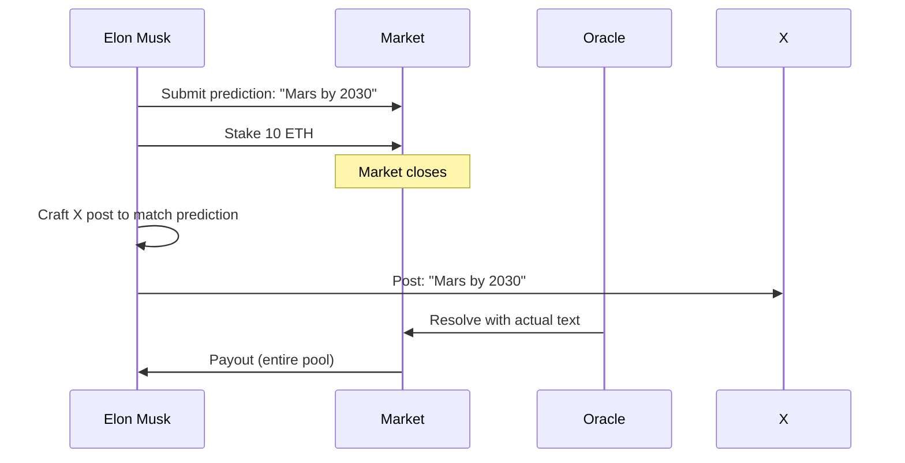

# Attack Vectors and Security Analysis

This document outlines known security considerations, attack vectors, and mitigation strategies for Proteus text prediction markets.

<Warning>
**Security Status**: This is a v0 alpha prototype on BASE Sepolia testnet. **No external security audit has been performed.** Do not deploy to mainnet without a comprehensive audit.
</Warning>

## Critical Attack Vectors

### 1. Self-Oracle Exploits

<Card title="Attack: Resolution Oracle Manipulation" icon="user-shield">
The person whose posts are being predicted could participate in the market and then deliberately craft their post to match their own prediction.
</Card>

#### Scenario



#### Mitigation Strategies

<AccordionGroup>
  <Accordion title="Detection" icon="magnifying-glass">
    **Pattern Analysis**
    - Monitor for correlation between submission addresses and subject's known wallets
    - Flag markets where the subject or close associates participate
    - Track post timing relative to market close (suspiciously timed posts)
    
    **Anomaly Detection**
    - Posts that match predictions with distance 0 or 1 should trigger review
    - Unusual betting patterns (large late bets by unknown addresses)
  </Accordion>
  
  <Accordion title="Prevention" icon="shield">
    **Wallet Screening**
    - Blacklist known wallets associated with the prediction target
    - Require KYC for high-value markets (compromises privacy)
    - Implement stake limits per address
    
    **Market Design**
    - Betting cutoff: No submissions within 1 hour of market end (currently implemented)
    - Resolution delay: Markets don't resolve immediately after post appears
    - Multi-oracle consensus: Reduces single point of manipulation
  </Accordion>
  
  <Accordion title="Post-Detection Response" icon="gavel">
    **Economic Penalties**
    - Forfeit stake if manipulation is proven
    - Distribute forfeited funds to other participants
    
    **Market Cancellation**
    - Full refunds if oracle consensus flags suspicious activity
    - Reputation system for subjects (subjects with history of manipulation get flagged)
  </Accordion>
</AccordionGroup>

<Info>
**Current Status**: The v0 contract implements `BETTING_CUTOFF = 1 hour` to prevent last-second submissions, but does not yet implement wallet screening or multi-oracle consensus.
</Info>

---

### 2. Insider Information

<Card title="Attack: Unfair Information Advantage" icon="user-secret">
Employees, family members, or associates of the prediction target have access to draft posts, rehearsed messaging, or internal communications.
</Card>

#### Scenario

From [Example 3](/research/worked-examples#example-3-insider-leaks-exact-wording-zuckerberg):

```text
Meta intern sees draft marketing deck with exact copy:
"Introducing Meta Ray-Ban with live AI translation in 12 languages."

Intern submits prediction with distance 3 vs AI's distance 25.
22-edit advantage = entire pool.
```

#### Is This a Bug or a Feature?

<Tabs>
  <Tab title="It's a Feature">
    **Information Markets Price Information**
    
    - Prediction markets are *supposed* to aggregate dispersed information
    - Insider trading is valuable signal in financial markets (controversial but debated)
    - The market accurately reflects that some participants have better information
    - Continuous distance metric ensures the advantage is proportional to information quality
    
    **Transparency Argument**
    - All submissions are on-chain and timestamped
    - Post-resolution analysis can identify likely insider participation
    - Community can decide whether to participate in markets with known insider risk
  </Tab>
  
  <Tab title="It's a Problem">
    **Fairness Concerns**
    
    - Undermines market integrity if outcomes are predetermined
    - Retail participants can't compete with structural information advantages
    - Reduces participation (why bet if insiders always win?)
    
    **Legal Risk**
    - Material non-public information (MNPI) laws may apply
    - Employees leaking company communications could face legal action
    - Platform could be liable for facilitating insider trading equivalent
  </Tab>
</Tabs>

#### Mitigation Strategies

<CodeGroup>
```solidity Market-Level Flags
// Flag markets with suspected insider participation
struct Market {
    ...
    bool suspectedInsiderActivity;
    uint8 insiderRiskScore;  // 0-100
}

function flagInsiderRisk(bytes32 marketId, uint8 score) 
    external onlyRole(ORACLE_ROLE) 
{
    markets[marketId].insiderRiskScore = score;
    emit InsiderRiskFlagged(marketId, score);
}
```

```python Post-Resolution Analysis
# Detect insider patterns
def analyze_insider_risk(market):
    winner_distance = market.winning_submission.distance
    
    if winner_distance <= 3:
        # Very precise prediction
        check_wallet_connections(winner_address, target_address)
        check_submission_timing(submission_time, post_time)
        check_historical_pattern(winner_address)
        
    return insider_probability_score
```
</CodeGroup>

<Warning>
**No Complete Solution**: Insider information is fundamentally difficult to prevent in public prediction markets. The best approach is transparency + community awareness.
</Warning>

---

### 3. AI-Induced Behavior Modification

<Card title="Attack: Feedback Loop Manipulation" icon="rotate">
Public figures change their behavior because they know prediction markets exist, either to match their own predictions or to deliberately frustrate predictors.
</Card>

#### Scenario 1: Matching Own Prediction


#### Scenario 2: Deliberate Frustration

```text
Elon Musk sees 1000 predictions about Starship launch.
Decides to post about Neuralink instead.
All predictors lose.
Musk finds it amusing.
```

#### Heisenberg Uncertainty for Social Behavior

The act of observing (predicting) changes the behavior:

<Info>
**The Observer Effect**: Public figures who know their posts are being predicted may:

1. **Conform** — Stick to predictable patterns to maintain personal brand consistency
2. **Rebel** — Deliberately deviate to assert independence
3. **Exploit** — Participate in markets and match their own predictions

All three behaviors compromise market integrity in different ways.
</Info>

#### Mitigation Strategies

<AccordionGroup>
  <Accordion title="Obscurity" icon="eye-slash">
    **Keep Markets Low-Profile**
    - Don't publicly announce which targets are being predicted
    - Private/invite-only markets for sensitive targets
    - Delay market visibility until after resolution
    
    **Limitation**: Doesn't scale — markets need liquidity, which requires publicity
  </Accordion>
  
  <Accordion title="Volume Threshold" icon="chart-line">
    **Only Resolve High-Volume Markets**
    - Markets below certain stake threshold get refunded
    - Prevents single-person manipulation (requires many participants)
    
    **Implementation**:
    ```solidity
    uint256 constant MIN_TOTAL_STAKE = 10 ether;
    
    function canResolve(bytes32 marketId) public view returns (bool) {
        return markets[marketId].totalStake >= MIN_TOTAL_STAKE;
    }
    ```
  </Accordion>
  
  <Accordion title="Reputation System" icon="star">
    **Track Subject Behavior**
    - Subjects who frequently post unpredictably get flagged
    - Markets on flagged subjects have higher risk warnings
    - Community can choose to avoid high-variance subjects
  </Accordion>
</AccordionGroup>

<Check>
**Philosophical Take**: If prediction markets cause public figures to be *more* predictable (conforming to patterns), that might be a feature, not a bug — markets are incentivizing consistency and transparency.
</Check>

---

### 4. Oracle Centralization Risk

<Card title="Current State: Single Oracle" icon="triangle-exclamation">
The v0 contract uses a single externally owned account (EOA) to resolve markets. This is the most significant centralization risk.
</Card>

#### Attack Surface

```solidity
function resolveMarket(
    bytes32 _marketId,
    string calldata _actualText
) external onlyOwner {
    // Single EOA can set arbitrary resolution text
    // No verification, no consensus, no slashing
}
```

**Risk**: Malicious or compromised oracle can:
- Resolve markets with incorrect text
- Favor specific participants
- Refuse to resolve markets (DoS)
- Extract bribes for favorable resolution

#### Planned Upgrade Path

<Steps>
  <Step title="Commit-Reveal Oracle Consensus">
    Multiple registered oracles independently submit the actual text in a commit phase, then reveal.
    
    ```solidity
    struct OracleCommit {
        bytes32 commitHash;
        string revealedText;
        bool revealed;
    }
    
    mapping(bytes32 => mapping(address => OracleCommit)) public oracleCommits;
    ```
  </Step>
  
  <Step title="Consensus Mechanism">
    The majority text (or the text with minimum aggregate distance among oracle submissions) is accepted.
    
    ```solidity
    function calculateConsensus(bytes32 marketId) internal returns (string memory) {
        // Find text with minimum total distance to all other oracle submissions
        // This is more robust than simple majority for continuous distance metrics
    }
    ```
  </Step>
  
  <Step title="Slashing for Dishonest Oracles">
    Oracles whose submissions deviate significantly from the consensus forfeit staked collateral.
    
    ```solidity
    uint256 constant SLASH_THRESHOLD = 20;  // edit distance
    
    function slashDishonestOracle(address oracle, bytes32 marketId) internal {
        uint256 distance = levenshteinDistance(
            oracleSubmissions[oracle],
            consensusText
        );
        
        if (distance > SLASH_THRESHOLD) {
            slash(oracle, ORACLE_STAKE);
        }
    }
    ```
  </Step>
  
  <Step title="Screenshot Proof">
    IPFS-pinned screenshot of the actual post, linked to the resolution transaction for auditability.
    
    ```solidity
    struct Resolution {
        string actualText;
        string ipfsScreenshotHash;
        uint256 timestamp;
        address[] oracles;
    }
    ```
  </Step>
</Steps>

<Info>
**X API Economics**: As of February 2026, X offers pay-per-use API access. This makes independent, multi-oracle tweet verification economically viable for the first time (previously, $200/month subscriptions made this prohibitive).
</Info>

---

### 5. Sybil Attacks

<Card title="Attack: Single Actor, Multiple Addresses" icon="users">
One participant creates multiple addresses to submit many predictions, increasing their chance of winning by flooding the outcome space.
</Card>

#### Scenario

```text
Attacker creates 1000 addresses.
Each submits a slightly different prediction:
"Mars by 2030"
"Mars by 2031"
"Moon by 2030"
...

One of them will likely be close to the actual text.
Attacker wins despite not having better information.
```

#### Economic Mitigation

<Info>
**Minimum Stake Requirement**: The contract enforces `MIN_BET = 0.001 ETH` per submission. To flood the space with 1000 predictions costs at least 1 ETH.

If the pool is smaller than 1 ETH, the attack is unprofitable. If the pool is larger, other participants can also flood the space, creating a costly arms race.
</Info>

#### Why Levenshtein Distance Helps

```text
Outcome space: 95^280 ≈ 10^554 possibilities

1000 predictions cover approximately:
1000 / 10^554 ≈ 0% of the space

Even 1 million predictions cover ≈ 0% of the space.
```

The combinatorial explosion makes brute-force sampling economically infeasible.

#### Additional Mitigations

<CodeGroup>
```solidity Progressive Stake Requirement
// Each additional submission from same address costs more
mapping(address => uint256) public submissionCount;

function calculateRequiredStake(address submitter) public view returns (uint256) {
    uint256 count = submissionCount[submitter];
    return MIN_BET * (2 ** count);  // Exponential increase
}
```

```python Rate Limiting
# Limit submissions per address per time window
MAX_SUBMISSIONS_PER_HOUR = 10
MAX_SUBMISSIONS_PER_MARKET = 50

def check_rate_limit(address, market_id):
    recent_count = count_submissions_last_hour(address)
    total_count = count_submissions_for_market(address, market_id)
    
    if recent_count >= MAX_SUBMISSIONS_PER_HOUR:
        raise RateLimitError("Too many submissions in last hour")
    
    if total_count >= MAX_SUBMISSIONS_PER_MARKET:
        raise RateLimitError("Max submissions per market reached")
```
</CodeGroup>

---

## Smart Contract Security

### Static Analysis Results

<Card title="Slither Analysis" icon="magnifying-glass-chart" href="/research/security-analysis">
Static analysis was performed on all Proteus smart contracts using Slither v0.11.3. See the full [Security Analysis Report](/research/security-analysis) for details.
</Card>

#### Key Findings Summary

| Severity | Count | Status |
|----------|-------|--------|
| High | 5 | Mostly false positives (arbitrary-send-eth by design) |
| Medium | 38 | **1 real bug FIXED** (AdvancedMarkets locked-ether) |
| Low | 40 | Acceptable (timestamp usage, gas efficiency) |
| Informational | 165 | Style/naming conventions |
| Optimization | 29 | Gas optimization opportunities |

<Warning>
**Critical Finding (FIXED)**: AdvancedMarkets.sol had a locked-ether vulnerability where ETH could be deposited but not withdrawn. This has been remediated with resolution, claim, and emergency withdrawal functions.
</Warning>

### Pre-Mainnet Checklist

<Steps>
  <Step title="External Security Audit">
    Engage reputable auditor (Trail of Bits, OpenZeppelin, ConsenSys Diligence) for comprehensive review of:
    - PredictionMarketV2.sol
    - PayoutManager.sol
    - DistributedPayoutManager.sol
    - Oracle integration contracts
  </Step>
  
  <Step title="Fix Precision Loss">
    Review and fix divide-before-multiply patterns in BuilderRewardPool and fee distribution logic.
  </Step>
  
  <Step title="Implement Multi-Oracle Resolution">
    Replace single-EOA oracle with commit-reveal consensus mechanism.
  </Step>
  
  <Step title="Multisig for Admin Functions">
    Deploy Gnosis Safe 2-of-3 multisig for contract owner key.
  </Step>
  
  <Step title="Bug Bounty Program">
    Launch public bug bounty (Immunefi, Code4rena) with meaningful rewards.
  </Step>
</Steps>

---

## Economic Attacks

### 6. Wash Trading

**Attack**: Create markets with no genuine interest, submit multiple predictions from controlled addresses, resolve in favor of one address, extract platform fees.

**Mitigation**:
- Minimum participant requirement (currently `MIN_SUBMISSIONS = 2`, should increase to 5-10)
- Fee structure that penalizes low-volume markets
- Community curation of featured markets

### 7. Front-Running

**Attack**: Monitor mempool for resolution transactions, submit prediction just before resolution with actual text.

**Mitigation**:
- **Currently implemented**: `BETTING_CUTOFF = 1 hour` prevents submissions near market end
- Oracle commit-reveal prevents mempool sniping
- Private RPC for oracle transactions (Flashbots, Eden Network)

### 8. Griefing

**Attack**: Submit spam predictions to inflate resolution gas costs or clog the market.

**Mitigation**:
- Minimum stake requirement (`MIN_BET = 0.001 ETH`) makes spam expensive
- Levenshtein distance's anti-bot property (random text achieves near-maximal distance)
- Gas limit on resolution transaction

---

## Conclusion

<CardGroup cols={2}>
  <Card title="Known Risks" icon="triangle-exclamation">
    - Single-oracle centralization (critical)
    - Self-oracle exploits (high)
    - Insider information (medium, may be feature)
    - AI behavior modification (philosophical)
  </Card>
  <Card title="Strong Defenses" icon="shield-check">
    - Natural Sybil resistance (combinatorial explosion)
    - Anti-bot mechanism (Levenshtein distance metric)
    - Betting cutoff prevents front-running
    - On-chain transparency enables post-hoc analysis
  </Card>
</CardGroup>

<Warning>
**DO NOT DEPLOY TO MAINNET** without:
1. External security audit
2. Multi-oracle consensus implementation
3. Multisig for admin functions
4. Legal review of insider trading implications
</Warning>

See the full [Security Analysis Report](https://github.com/timepoint-ai/proteus/blob/main/docs/SECURITY-ANALYSIS.md) for detailed Slither results and remediation status.
