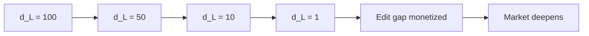

# The AI-Resistance Thesis

Binary prediction markets encode exactly one bit of information per contract. The outcome space is {0, 1}, and as AI systems approach superhuman forecasting along an exponential capability curve, the edge any participant can capture in a binary market collapses toward zero because the correct answer becomes trivially computable.

**Text prediction markets are different.** They don't commoditize as AI improves — they deepen.

## The Core Argument

<CardGroup cols={2}>
  <Card title="Binary Markets" icon="binary">
    **Outcome space**: {0, 1}  
    **Information density**: 1 bit  
    **AI effect**: Converges → commoditizes
  </Card>
  <Card title="Text Markets" icon="text">
    **Outcome space**: 95^280 ≈ 10^554  
    **Information density**: 1,840 bits  
    **AI effect**: Differentiates → deepens
  </Card>
</CardGroup>

### Information Density

Text prediction over an alphabet Σ with strings up to length *n* has a combinatorially explosive outcome space:

```text
|O_text| ≈ |Σ|^n

For printable ASCII (|Σ| = 95) and tweet length (n = 280):
|O_text| ≈ 95^280 ≈ 10^554

Information content:
I_text = 280 × log₂(95) ≈ 1,840 bits

Ratio: I_text / I_binary = 1,840 / 1 = 1,840:1
```

<Warning>
The text prediction space contains roughly 10^554 possible outcomes — **470 orders of magnitude larger than the number of atoms in the observable universe**. No AI system, no matter how capable, will exhaust this space.
</Warning>

## Continuous Payoff Surface

### Binary Markets: A Cliff

In a binary prediction market, you're either right or wrong. The payoff function is a step function:

```python
def binary_payout(prediction, actual):
    return pool if prediction == actual else 0
```

Once AI models converge on the correct probability (say, 87% yes), the spread vanishes. **There's no gradient to climb.**

### Text Markets: A Gradient

Levenshtein distance induces a proper metric on the space of text predictions, creating a continuous payoff surface:

```python
def text_payout(prediction, actual, all_predictions):
    distance = levenshtein(prediction, actual)
    return pool if distance == min(all_distances) else 0
```

A prediction that differs from the actual text by 1 edit is meaningfully better than one that differs by 8 edits. **Every character of precision is rewarded.**

<Info>
**Lipschitz Continuity**: The expected payoff is Lipschitz-continuous with respect to prediction quality. Marginal improvements in language modeling *always* translate to marginal improvements in expected payout.
</Info>

## The Thesis Example: AI vs AI

**Market**: What will @sataborasu (Satya Nadella) post?  
**Actual text**: `Copilot is now generating 46% of all new code at GitHub-connected enterprises. The AI transformation of software is just beginning.`

| Submitter | Predicted Text | Distance |
|-----------|---------------|----------|
| **Claude roleplay** | `Copilot is now generating 45% of all new code at GitHub-connected enterprises. The AI transformation of software is just beginning.` | **1** |
| GPT roleplay | `Copilot is now generating 43% of all new code at GitHub-connected enterprises. The AI transformation of software has just begun.` | 8 |
| Human (vague) | `Microsoft AI is great and will change the world of coding forever` | 101 |

### What This Demonstrates

1. **Same prompt, same corpus**: Both Claude and GPT were given identical prompts and have access to the same public training data
2. **7-edit gap = entire pool**: Claude's 1-edit prediction beats GPT's 8-edit prediction. The winner takes all.
3. **Binary would split nothing**: In a yes/no framing ("Will Nadella post about Copilot?"), both AIs "predicted correctly" — both would get zero edge

<Tip>
The key difference: Claude predicted `45%` while the actual was `46%`. GPT predicted `43%` and also substituted "has just begun" for "is just beginning." These marginal calibration differences are *monetizable* in a Levenshtein-scored market.
</Tip>

## Why AI Deepens the Game

### Binary Markets: Convergence

As AI forecasting improves:


When every participant runs the same frontier model and gets the same probability estimate, **the market reduces to a coin flip over the remaining uncertainty**.

### Text Markets: Differentiation

As AI language modeling improves:



When models converge on *nearly* the same text prediction, **the remaining edits become MORE valuable, not less**.

<Check>
**Structural Difference**: Binary markets have diminishing returns as AI improves. Text markets have *increasing* returns.
</Check>

## The 99th vs 99.9th Percentile

Consider the value of marginal improvement:

### Binary Market

```text
99th percentile model: P(yes) = 0.87 ± 0.03
99.9th percentile model: P(yes) = 0.87 ± 0.02

Difference: Negligible — both models cluster around the same probability
Monetizable edge: ~0
```

### Text Market

```text
99th percentile model: d_L = 8
99.9th percentile model: d_L = 1

Difference: 7 edits
Monetizable edge: Entire pool (93% after fees)
```

The distance between the 99th and 99.9th percentile language model corresponds to **dozens of edit operations**, each worth money.

## AI Roleplay as Prediction Strategy

The dominant strategy for text prediction is to prompt a frontier LLM with a persona simulation request:

```text
You are @elonmusk. You are about to post on X about Starship. 
Write your exact post, including punctuation, numbers, and phrasing.
```

The model generates text that attempts to match:

- **Vocabulary distribution**: Which words and phrases the person uses most frequently
- **Sentence structure**: Characteristic syntax, paragraph length, use of fragments
- **Rhetorical patterns**: How the person introduces products, responds to criticism
- **Numerical tendencies**: Whether they use precise numbers ("46%") or round numbers ("about half")
- **Punctuation and formatting**: Use of periods vs. exclamation marks, capitalization patterns

<Info>
**Why This Works**: Large language models are trained on vast corpora of public text. For public figures with large digital footprints, the model has internalized their stylistic patterns.
</Info>

## The Inevitability Spectrum

Three factors determine how predictable a given post is:

<AccordionGroup>
  <Accordion title="Inevitability" icon="calendar-check">
    **High**: Rehearsed messaging — product launches, earnings summaries, policy announcements  
    **Low**: Spontaneous, personal commentary  
    **Effect**: High inevitability favors AI prediction
  </Accordion>
  <Accordion title="Personality" icon="user">
    **Idiosyncratic style**: Creates both signal (capturable patterns) and noise (spontaneous tangents)  
    **Effect**: AI captures statistical patterns but misses in-the-moment deviations
  </Accordion>
  <Accordion title="Situational Context" icon="info-circle">
    **Internal decisions**: Unavailable to AI models with training data cutoffs  
    **Breaking news**: Real-time information not in training corpus  
    **Effect**: Low inevitability and high situational specificity favor human insiders
  </Accordion>
</AccordionGroup>

### Strategic Landscape

| Target Type | Inevitability | Dominant Strategy |
|-------------|---------------|-------------------|
| Corporate launch | High | AI roleplay |
| Rehearsed messaging | High | Insider > AI |
| Product marketing | High | Leak/insider |
| Spontaneous/personal | Low | Human intuition |
| Silence/inaction | N/A | Null trader |
| Random/chaotic | Low | No reliable strategy |

<Check>
**Market Health**: No single strategy dominates all market types. AI excels at high-inevitability targets. Insiders win when situational context matters. Null traders capture the inaction primitive.
</Check>

## Fast Takeoff Considerations

If a fast AI takeoff happens, forecasting models may radically reduce available rewards in binary prediction markets as models finetune around predictive performance. Submissions to TRUE/FALSE markets may have decreasing entropy, thus decreasing rewards and incentives.

**Text prediction offers a much more difficult challenge** for even the most advanced AI roleplay models to forecast precisely, and a larger surface over which participants can bet and win.

### Training Data Feedback Loop

Every resolved Proteus market produces a naturally labeled training example:

```python
{
  "predicted_text": "...",
  "actual_text": "...",
  "levenshtein_distance": 1,
  "context": {
    "target_handle": "@sataborasu",
    "time_window": "2026-03-01 to 2026-03-15",
    "competitors": 47
  }
}
```

This accumulates into a structured dataset of `(prediction, actual, distance, context)` tuples — **purpose-built for fine-tuning persona simulation models**.

<Info>
Unlike static benchmarks that leak into pretraining, Proteus training data is **adversarially generated in real time** — the test set is always the next unresolved market.
</Info>

## Conclusion

The approaching AI capability explosion does not flatten text prediction markets. **It deepens them.**

<CardGroup cols={2}>
  <Card title="Binary Markets" icon="chart-line-down">
    Converge → Commoditize → Spread vanishes
  </Card>
  <Card title="Text Markets" icon="chart-line-up">
    Differentiate → Deepen → Edit gap monetized
  </Card>
</CardGroup>

Levenshtein distance induces a proper metric on the space of text predictions, creating a continuous payoff surface where marginal improvements in language modeling *always* translate to marginal improvements in expected payout.

**The payoff function is Lipschitz-continuous with respect to prediction quality.**

That's the structural difference that makes text prediction markets AI-resistant.
