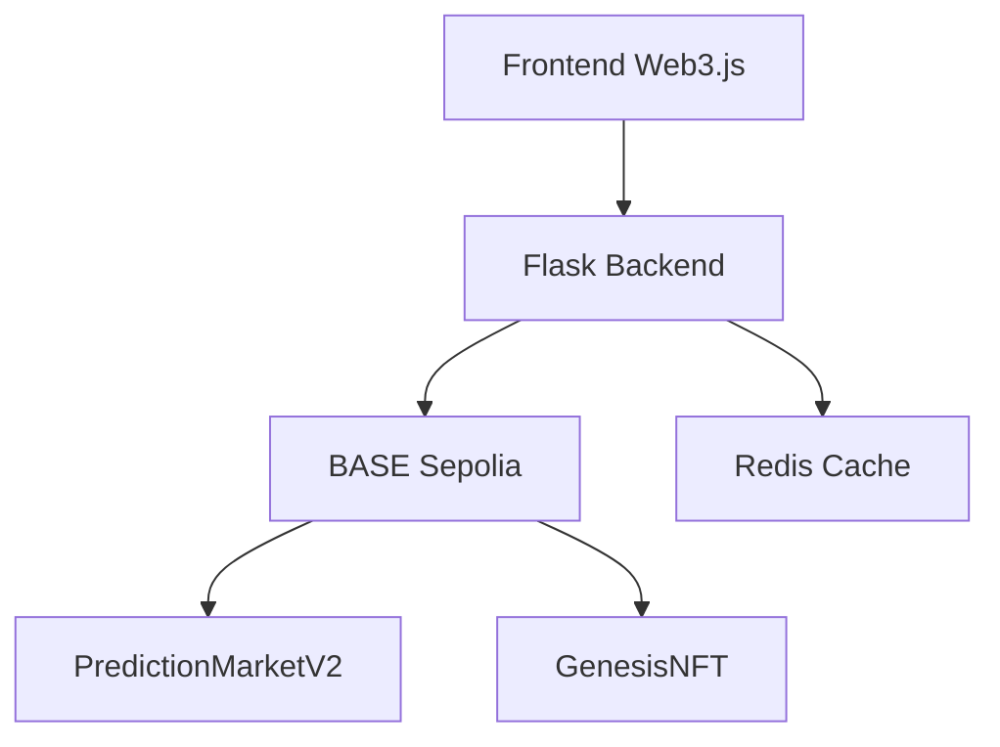

# Proteus: Continuous-Gradient Prediction Markets via On-Chain Levenshtein Distance

**On the Information-Theoretic Collapse of Binary Markets and the Case for Metric-Scored Text Prediction**

**Sean McDonald**  
**with many AI models**

*February 2026*

## Abstract

Binary prediction markets encode exactly one bit of information per contract. As AI forecasting systems approach superhuman calibration, the marginal edge any participant can capture in a binary market collapses toward zero — the correct answer becomes trivially computable, and spreads vanish. We propose an alternative market structure in which participants predict the *exact text* a public figure will post, scored by Levenshtein edit distance. Text prediction over a 95-character printable ASCII alphabet with strings up to length 280 yields an outcome space of approximately 95^280 ≈ 10^554 possibilities, encoding roughly 1,840 bits of information per market versus 1 bit for binary contracts — a 1,840:1 improvement in information density.

Levenshtein distance induces a proper metric on this space (satisfying identity, symmetry, and the triangle inequality), which means payoffs are not a binary cliff but a continuous gradient surface where every character of precision is rewarded. We demonstrate this with a thesis example: given the same prompt and public training corpus, Claude predicts a Satya Nadella post at edit distance 1 while GPT achieves distance 8 — a 7-edit gap that determines the entire pool. In a binary market, both models "predicted correctly" and split nothing.

## Key Contributions

<CardGroup cols={2}>
  <Card title="Formal Analysis" icon="function">
    Proofs of metric properties, outcome space analysis, and payoff surface characterization
  </Card>
  <Card title="Working Prototype" icon="flask">
    Deployed on BASE Sepolia with on-chain Levenshtein computation in 513 lines of Solidity
  </Card>
  <Card title="Worked Examples" icon="vial">
    Six demonstrations spanning AI roleplay, insider advantage, null prediction, and bot filtration
  </Card>
  <Card title="Attack Vector Analysis" icon="shield">
    Self-oracle exploits, insider dynamics, AI-induced behavior modification, Sybil resistance
  </Card>
</CardGroup>

## The Commoditization Problem

Prediction markets are no longer a niche experiment. Polymarket and Kalshi combined processed approximately $40 billion in volume in 2025. Industry projections estimate 445 billion contracts and $222.5 billion in notional volume for 2026, representing 47% annual growth.

These markets all operate on the same simple primitive: a contract resolves to 0 or 1, and participants trade shares priced between $0 and $1 reflecting the market's collective probability estimate.

**This structure has a fundamental limitation.** As AI forecasting systems improve along what appears to be an exponential capability curve, the edge available in binary markets shrinks. When every sophisticated participant's model outputs "87% yes" on the same question, the spread vanishes and the market becomes commoditized. The information content of a binary outcome is exactly 1 bit — there is no room for gradations of skill once the probability estimate converges.

## Text Prediction as Richer Outcome Space

Consider predicting not *whether* something happens, but *the exact words* a public figure will use to describe it. The outcome space changes dramatically:

<CodeGroup>
```text Binary Market
Outcome space: {0, 1}
Information content: 1 bit
```

```text Text Prediction Market
Outcome space: 95^280 ≈ 10^554
Information content: 280 × log₂(95) ≈ 1,840 bits
```
</CodeGroup>

This is not a marginal improvement. The text prediction space contains roughly 10^554 possible outcomes, a number that exceeds the estimated number of atoms in the observable universe by over 470 orders of magnitude. No AI system, no matter how capable, will exhaust this space.

<Info>
**Information Density Ratio**: Text prediction markets encode approximately **1,840 times** more information than binary prediction markets.
</Info>

## Mathematical Foundations

### Levenshtein Distance as Metric

The Levenshtein distance d_L(a, b) between two strings is the minimum number of single-character edit operations (insertions, deletions, substitutions) required to transform one string into another.

**Theorem**: d_L is a proper metric on the space of strings, satisfying:

1. **Identity of indiscernibles**: d_L(a, b) = 0 if and only if a = b
2. **Symmetry**: d_L(a, b) = d_L(b, a)
3. **Triangle inequality**: d_L(a, c) ≤ d_L(a, b) + d_L(b, c)

### Payoff Surface

The Proteus payout mechanism is winner-take-all:

```solidity
fee = ⌊pool × 700 / 10000⌋       // 7% platform fee
payout = pool − fee                 // 93% to winner
winner = argmin_{s ∈ submissions} d_L(s.predictedText, actualText)
```

**Lipschitz Continuity**: The expected payoff is Lipschitz-continuous with respect to prediction quality — marginal improvements in distance *always* translate to marginal improvements in expected payout. There is no "close enough" threshold below which improvements stop mattering. **Every edit counts.**

### Algorithmic Complexity

The standard Wagner-Fischer dynamic programming algorithm computes d_L(a, b) in O(mn) time using O(min(m, n)) space.

**Gas costs on BASE L2** (approximate):

| String Length | Gas Cost |
|---------------|----------|
| 50 characters | ~400,000 |
| 100 characters | ~1,500,000 |
| 280 characters | ~9,000,000 |

The contract enforces `MAX_TEXT_LENGTH = 280` (tweet length) to prevent block gas limit denial-of-service.

## System Design

### Architecture



All market data lives on-chain. There is no database. Redis is used only for caching RPC responses, authentication nonces and OTPs, and rate limiting.

### Contract Constants

| Constant | Value | Purpose |
|----------|-------|----------|
| `PLATFORM_FEE_BPS` | 700 (7%) | Fee taken from winning pool |
| `MIN_BET` | 0.001 ETH | Minimum stake per submission |
| `BETTING_CUTOFF` | 1 hour | No submissions within 1 hour of market end |
| `MIN_SUBMISSIONS` | 2 | Minimum entries for valid resolution |
| `MAX_TEXT_LENGTH` | 280 | Character limit (tweet length, gas cap) |

### The Null Sentinel

The contract reverts on empty strings. To express the prediction "this person will not post," participants submit the sentinel value `__NULL__`. When resolution also uses `__NULL__`:

```text
d_L("__NULL__", "__NULL__") = 0
```

This creates a market primitive that binary contracts cannot express: **betting on silence**. AI roleplay agents always generate text — they cannot predict inaction.

## X as Resolution Infrastructure

Text prediction markets require a resolution source: a public, timestamped, attributable record of what a person actually said. X (formerly Twitter) is uniquely suited to this role.

### Why X Specifically

X posts have four properties that make them suitable for market resolution:

<AccordionGroup>
  <Accordion title="Public" icon="globe">
    Posts are visible without authentication. No scraping or privileged access is required for verification.
  </Accordion>
  <Accordion title="Timestamped" icon="clock">
    Each post carries a server-side timestamp accurate to the second, enabling dispute resolution about whether a post fell within a market's resolution window.
  </Accordion>
  <Accordion title="Attributable" icon="user-check">
    The handle-to-person mapping is well-established for public figures, and X's verification system provides a baseline identity layer.
  </Accordion>
  <Accordion title="Immutable in Real-Time" icon="lock">
    While posts can be edited or deleted after the fact, edits are detectable via the X API, and third-party archival services provide independent records.
  </Accordion>
</AccordionGroup>

### Market-Moving Speech

X posts are financial events:

- **Elon Musk's tweets** have produced approximately 3% price moves in DOGE on multiple occasions
- **Donald Trump's Truth Social posts** in March 2025 naming specific cryptocurrencies triggered a $300 billion crypto market rally
- **Sam Altman's statements** on X have moved AI sector sentiment, with Microsoft stock reaching all-time highs on key announcements

<Info>
**API Update (Feb 2026)**: X now offers pay-per-use API access — no subscriptions, no monthly caps, just credit-based billing. This makes independent, multi-oracle tweet verification economically viable for the first time.
</Info>

## Economic Opportunity

Prediction markets represent a $40 billion market in 2025, with projections of $222.5 billion in notional volume by 2026 and a total addressable market exceeding $100 billion within the decade.

### Adjacent Markets

- **Sports betting**: $100.9 billion in 2024, projected to reach $187 billion by 2030 (11% CAGR)
- **Creator economy**: Monetizing attention and influence
- **Corporate communications monitoring**: Market-moving executive statements

## Full Paper

The complete whitepaper includes:

- Detailed prediction market landscape analysis (boom and bust history)
- Related work on scoring rules and string metrics
- Complexity-theoretic framing of text prediction as AI capability proxy
- Market lifecycle dynamics and limiting cases
- Fast takeoff considerations

<Card title="Read the Full Whitepaper" icon="arrow-right" href="https://github.com/timepoint-ai/proteus/blob/main/WHITEPAPER.md">
  Access the complete research paper with formal proofs, extended economic analysis, and technical appendices.
</Card>

## Citation

```bibtex
@article{mcdonald2026proteus,
  title={Proteus: Continuous-Gradient Prediction Markets via On-Chain Levenshtein Distance},
  author={McDonald, Sean},
  year={2026},
  month={February}
}
```
