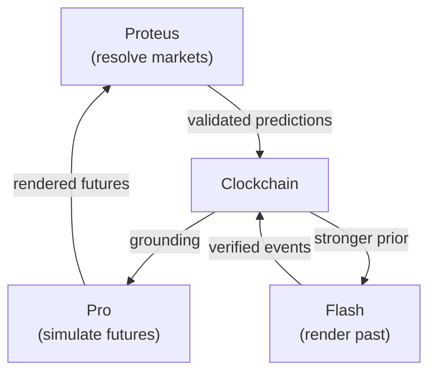

Proteus serves as the settlement layer for the Timepoint Suite, validating AI-generated future predictions (Rendered Futures) against actual outcomes. This page explains how Proteus integrates with other Timepoint components.

## Architecture Overview



## Core Integration Points

### 1. Pro → Proteus: Rendered Futures

**Pro** (the rendering engine) generates predictions about future events using SNAG (Situation-based Natural Anticipatory Generation). These predictions are called **Rendered Futures**.

In the current v0 implementation, predictions are submitted manually by participants. In Phase 2, Pro will generate predictions directly in TDF format that can be submitted to Proteus markets.

**Flow:**
1. Pro simulates multiple future scenarios
2. Scenarios are expressed as text predictions (v1) or structured TDF records (v2)
3. Predictions are submitted to Proteus markets as competing renderings
4. Market participants stake ETH on their chosen rendering

### 2. Proteus → Clockchain: Validated Predictions

When a Proteus market resolves, the winner is determined by on-chain Levenshtein distance computation. **Winners are the best renderers**—their predictions were closest to reality.

These validated predictions become candidates for graduation to the Clockchain as validated causal paths.

**Flow:**
1. Market resolves with oracle-provided actual text
2. On-chain Levenshtein distance determines winner
3. Validated prediction (with distance metric) is recorded
4. High-quality predictions (low distance) graduate to Clockchain
5. These become part of the growing temporal causal graph

### 3. Clockchain → Pro: Stronger Priors

The Clockchain accumulates validated predictions over time. This validated history serves as **grounding** for Pro's future simulations.

Every resolved Proteus market strengthens the Bayesian prior:
- Successful prediction patterns are identified
- Model accuracy improves for specific personas
- Temporal patterns emerge from accumulated data
- Future renderings become more accurate

**Flow:**
1. Clockchain maintains graph of validated predictions
2. Pro queries Clockchain for historical accuracy patterns
3. SNAG simulation is grounded by validated causal paths
4. New renderings incorporate learned patterns
5. Predictions submitted to Proteus are higher quality

### 4. Flash → Clockchain: Verified Events

**Flash** (the reality writer) renders grounded historical moments. These verified past events are recorded in the Clockchain, providing the "Rendered Past" component.

The Clockchain combines Rendered Past (Flash) and Rendered Future (Proteus-validated predictions) into a unified temporal causal graph.

## The Validation Loop

```mermaid
graph LR
    A[Render Future\n(Pro)] --> B[Submit Prediction\n(Proteus Market)]
    B --> C[Reality Occurs]
    C --> D[Resolve Market\n(Levenshtein Distance)]
    D --> E[Graduate to Clockchain\n(if high quality)]
    E --> F[Strengthen Prior]
    F --> A
```

This creates a self-improving loop:
1. Better predictions → Better Clockchain data
2. Better Clockchain data → Better Pro simulations
3. Better Pro simulations → Better predictions

## Distance Metric Evolution

The continuous-metric primitive generalizes across three phases:

### Phase 1: Exact Text (Current)

**Metric:** Levenshtein edit distance  
**Domain:** Character-level text predictions  
**Example:** Predict exact tweet text from @elonmusk

```solidity
function levenshteinDistance(
    string memory predicted,
    string memory actual
) public pure returns (uint256);
```

Winners are determined by minimum edit distance to actual text.

### Phase 2: Event Descriptions (Planned)

**Metric:** Semantic distance  
**Domain:** Event descriptions and structured predictions  
**Format:** TDF (Temporal Data Format)  

Predictions will be expressed as TDF records with structured fields:
- Event description
- Temporal bounds
- Actor identifications
- Causal relationships

Distance will be computed semantically, not character-by-character.

### Phase 3: Causal Subgraphs (Research)

**Metric:** Graph distance  
**Domain:** Predicted causal relationship networks  

Predictions will be subgraphs expressing expected causal relationships. Distance will measure graph similarity between predicted and actual causal structures.

## TDF Integration (Phase 2)

### Current State (v0)

Predictions are free-form strings:

```javascript
// Participant submits
{
  marketId: 1,
  predictedText: "Starship flight 2 is GO for March...",
  stake: "0.001" // ETH
}
```

### Future State (Phase 2)

Predictions will be TDF records:

```json
{
  "@context": "https://timepoint.ai/tdf/v1",
  "@type": "RenderedFuture",
  "prediction": {
    "actor": "@elonmusk",
    "event": "social_media_post",
    "content": "Starship flight 2 is GO for March...",
    "temporal": {
      "window_start": "2026-03-01T00:00:00Z",
      "window_end": "2026-04-01T00:00:00Z"
    },
    "confidence": 0.87,
    "renderer": "pro-v2.1",
    "causal_context": [
      "starship_test_1_success",
      "faa_approval_received"
    ]
  }
}
```

This enables:
- Rich metadata about predictions
- Causal context tracking
- Renderer attribution
- Cross-service interoperability

## Training Data Pipeline

Every resolved Proteus market generates training data for the entire Timepoint Suite.

### Data Generated

```javascript
// Per resolved market
{
  marketId: 123,
  target: "@sama",
  predictedText: "we are now confident AGI is achievable...",
  actualText: "we are now confident AGI is achievable...",
  levenshteinDistance: 4,
  submitter: "0x1234...",
  stake: "0.05 ETH",
  winner: true,
  blockNumber: 8675309,
  timestamp: "2026-03-15T14:23:11Z"
}
```

### Training Applications

**1. Persona Calibration**

Fine-tune models on resolved markets for specific targets:

```python
# Train on all @elonmusk markets
training_data = clockchain.query({
  "target": "@elonmusk",
  "resolved": True,
  "min_quality": 0.8  # d_L < 20
})

model.finetune(training_data)
```

**2. Numerical Precision**

Many markets hinge on exact numbers. Resolved markets provide ground truth:

```text
Predicted: "45% of all new code"
Actual:    "46% of all new code"
Distance:  1 edit (the number)

→ Training signal: Learn target's number rounding preferences
```

**3. Silence Prediction**

`__NULL__` markets label when targets don't post:

```python
null_markets = clockchain.query({
  "actualText": "__NULL__",
  "resolved": True
})

# Train model to predict silence/inaction
```

This is a signal that standard language model training cannot provide—the training corpus contains only text that was written, never text that wasn't.

## Implementation Status

### Current (v0 Alpha)

- ✅ Proteus markets resolve with Levenshtein distance
- ✅ On-chain validation of predictions
- ✅ Winner determination by minimum distance
- ✅ Market lifecycle: create → predict → resolve → claim
- ❌ TDF format not yet implemented
- ❌ Direct Pro integration not available
- ❌ Clockchain graduation criteria not formalized
- ❌ Automated training data pipeline not built

### Phase 2 (Planned)

- [ ] TDF format specification finalized
- [ ] Proteus accepts TDF-formatted predictions
- [ ] Pro can submit renderings directly to markets
- [ ] Clockchain graduation automated for high-quality predictions
- [ ] Training data pipeline extracts resolved markets
- [ ] Semantic distance metric for structured predictions

### Phase 3 (Research)

- [ ] Graph distance metric for causal subgraphs
- [ ] Multi-level predictions (text → events → graphs)
- [ ] Full Proof of Causal Convergence implementation
- [ ] Decentralized renderer network

## Code Example: Query Validated Predictions

When Clockchain integration is complete (Phase 2), you'll be able to query validated predictions:

```javascript
// Query Clockchain for validated Proteus predictions
const validatedPredictions = await clockchain.query({
  source: 'proteus',
  minQuality: 0.9,  // d_L < 10
  target: '@sama',
  dateRange: {
    start: '2026-01-01',
    end: '2026-03-31'
  }
});

// Use as training data for Pro
await pro.refine({
  persona: '@sama',
  trainingData: validatedPredictions,
  metric: 'levenshtein'
});

// Generate new rendering
const rendering = await pro.render({
  persona: '@sama',
  context: 'AGI announcement timing',
  window: {
    start: '2026-04-01',
    end: '2026-05-01'
  }
});

// Submit to Proteus market
await proteus.submitPrediction({
  marketId: newMarket.id,
  prediction: rendering.tdf,
  stake: ethers.utils.parseEther('0.1')
});
```

## Why This Architecture Matters

### 1. Natural Quality Filtering

Prediction markets naturally filter for quality:
- Low-quality predictions lose money
- High-quality predictions win and graduate to Clockchain
- Economic incentives align with data quality

### 2. Adversarial Training Data

Market competition creates adversarial diversity:
- Participants search for strategies others miss
- Distribution of predictions spans multiple approaches
- Training data includes both successes and failures

### 3. Continuous Improvement

The loop never stops:
- Every resolved market improves the Clockchain
- Improved Clockchain enables better Pro renderings
- Better renderings create higher-quality markets
- System capability compounds over time

### 4. Open Research Infrastructure

All core components are open source:
- Researchers can experiment with the suite
- New metrics and scoring methods can be tested
- Academic community can validate results
- Training data is publicly accessible

## Next Steps

<CardGroup cols={2}>
  <Card title="TDF Format" icon="code" href="/timepoint/tdf-format">
    Learn about the Temporal Data Format
  </Card>
  <Card title="Suite Overview" icon="diagram-project" href="/timepoint/overview">
    Explore the full Timepoint Suite
  </Card>
</CardGroup>

## Resources

- **Timepoint Thesis** (forthcoming): Formal specification of Rendered Past/Future framework
- **Pro Repository**: `timepoint-pro` (SNAG-powered simulation)
- **Clockchain Repository**: `timepoint-clockchain` (temporal causal graph)
- **TDF Repository**: `timepoint-tdf` (data format specification)
- **Follow**: [@seanmcdonaldxyz](https://x.com/seanmcdonaldxyz) for updates
