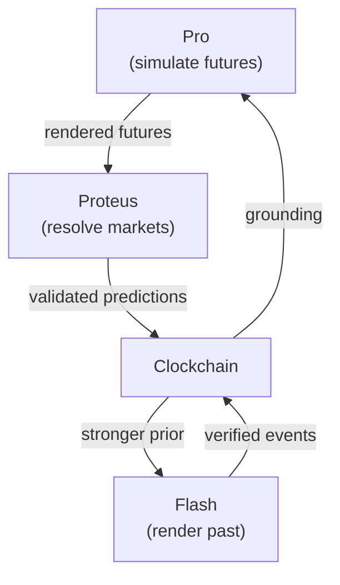
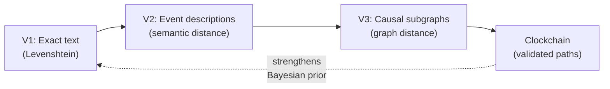

The Timepoint Suite is an ecosystem of open-source tools designed for temporal AI research. The suite enables rendering historical moments, simulating futures, validating predictions through markets, and building a continuously growing temporal causal graph.

## Core Philosophy

**Render the past. Simulate the future. Score the predictions. Accumulate the graph.**

The Timepoint Suite operates on a novel framework where AI-generated temporal content—both historical reconstructions and future simulations—forms a validated, interconnected knowledge graph. Proteus serves as the settlement layer that validates these "Rendered Futures" against reality.

## Suite Components

<CardGroup cols={2}>
  <Card title="Flash" icon="clock-rotate-left">
    Reality Writer — renders grounded historical moments (Synthetic Time Travel)
  </Card>
  <Card title="Pro" icon="wand-magic-sparkles">
    Rendering Engine — SNAG-powered simulation, TDF output, training data generation
  </Card>
  <Card title="Clockchain" icon="diagram-project">
    Temporal Causal Graph — Rendered Past + Rendered Future, growing 24/7
  </Card>
  <Card title="Proteus" icon="gavel">
    Settlement Layer — prediction markets that validate Rendered Futures
  </Card>
</CardGroup>

### Flash

**Type:** Open Source  
**Repository:** `timepoint-flash`  
**Role:** Reality Writer

Flash renders grounded historical moments, enabling what the Timepoint team calls "Synthetic Time Travel." It reconstructs past events with high fidelity, creating a rendered historical record that feeds into the Clockchain.

Key capabilities:
- Historical moment reconstruction
- Grounded reality generation
- Training data for temporal modeling
- Verified event records

### Pro

**Type:** Open Source  
**Repository:** `timepoint-pro`  
**Role:** Rendering Engine

Pro is the simulation engine that generates Rendered Futures. It uses SNAG (Situation-based Natural Anticipatory Generation) to power predictions and produces outputs in TDF format for interoperability across the suite.

Key capabilities:
- SNAG-powered future simulation
- TDF (Temporal Data Format) output
- Training data generation
- Multi-scenario rendering

### Clockchain

**Type:** Open Source  
**Repository:** `timepoint-clockchain`  
**Role:** Temporal Causal Graph

The Clockchain is a continuously growing graph that combines Rendered Past (from Flash) and Rendered Future (from Pro) into a unified temporal causal structure. It operates 24/7, accumulating validated predictions and historical reconstructions.

Key capabilities:
- Temporal causal graph accumulation
- Integration of rendered past and future
- Bayesian prior strengthening
- Continuous graph expansion

### Proteus

**Type:** Open Source  
**Repository:** `proteus` (this project)  
**Role:** Settlement Layer

Proteus validates Rendered Futures through prediction markets. Winners are the best renderers—their predictions become candidates for graduation to the Clockchain as validated causal paths. Every resolved market strengthens the Bayesian prior.

Key capabilities:
- Text prediction markets with continuous-gradient scoring
- On-chain Levenshtein distance computation
- Validation of Rendered Futures against reality
- Training signal for temporal AI models

## Supporting Infrastructure

### TDF (Temporal Data Format)

**Type:** Open Source  
**Repository:** `timepoint-tdf`  
**Role:** Data Format Standard

TDF is the JSON-LD interchange format used across all Timepoint services. It provides a standardized way to represent temporal predictions, historical reconstructions, and causal relationships.

### SNAG Bench

**Type:** Open Source  
**Repository:** `timepoint-snag-bench`  
**Role:** Quality Certifier

SNAG Bench measures Causal Resolution across renderings, providing quality assurance for the temporal AI outputs generated by the suite.

## The Rendered Futures Framework

Proteus fits into the Timepoint ecosystem as the reality validation layer. Here's how the flow works:

### Phase Evolution

The distance metric evolves across three phases:

**Phase 1 (Current - Proteus v0):** Exact text prediction scored by Levenshtein distance  
**Phase 2 (Planned):** Event descriptions scored by semantic distance  
**Phase 3 (Research):** Causal subgraph predictions scored by graph distance

The continuous-metric primitive—closest match wins on a gradient, not a cliff—generalizes at every level.

## TDF Integration (Phase 2)

Proteus predictions will be expressible as TDF records in Phase 2, enabling direct interoperability with the Clockchain and the broader Timepoint suite. This will allow:

- Predictions to be recorded in a standardized format
- Cross-service validation and reference
- Integration with Pro's rendering engine
- Contribution to the growing Clockchain graph

## Private Components

The Timepoint ecosystem includes several private production services:

- **Web App** (`timepoint-web-app`) - Browser client at app.timepointai.com
- **iPhone App** (`timepoint-iphone-app`) - iOS client for Synthetic Time Travel on mobile
- **Billing** (`timepoint-billing`) - Payment processing via Apple IAP + Stripe
- **Landing** (`timepoint-landing`) - Marketing site at timepointai.com

## The Timepoint Thesis

A forthcoming paper will formalize:
- The Rendered Past / Rendered Future framework
- The mathematics of Causal Resolution
- The TDF specification
- The Proof of Causal Convergence protocol

Follow [@seanmcdonaldxyz](https://x.com/seanmcdonaldxyz) for updates.

## Why This Matters

The Timepoint Suite represents a novel approach to temporal AI:

1. **Validated Training Data**: Predictions are tested against reality, creating high-quality training signals
2. **Continuous Improvement**: Every resolved market strengthens the Bayesian prior for future predictions
3. **Open Infrastructure**: All core components are open source, enabling research and experimentation
4. **Interoperability**: TDF provides a common format for temporal data across all services
5. **Graph Accumulation**: The Clockchain grows continuously, building a validated temporal knowledge base

## Next Steps

<CardGroup cols={2}>
  <Card title="Integration Guide" icon="plug" href="/timepoint/integration">
    Learn how Proteus integrates with the Timepoint Suite
  </Card>
  <Card title="TDF Format" icon="code" href="/timepoint/tdf-format">
    Understand the Temporal Data Format specification
  </Card>
</CardGroup>
